<p align="right">
  <strong>日本語</strong> | <a href="./README.md">English</a>
</p>

<h1 align="center">MotionPNGCreator for ArtificialGirlfriend<br><sub>～1枚の画像と1つのAPIキー、それだけでキャラクターの動く姿を量産する～</sub></h1>

<p align="center">
  <a href="LICENSE"></a>
  
  
  
  
</p>

<p align="center">
  <a href="https://github.com/ARP224/MotionPNGCreator-for-ArtificialGirlfriend/discussions"><b>Discussions</b></a>｜<a href="https://github.com/ARP224/MotionPNGCreator-for-ArtificialGirlfriend/issues"><b>Issues</b></a>
</p>

---

<p align="center">
  
</p>

<table align="center">
  <tr><th>解説動画</th></tr>
  <tr><td><a href="https://youtu.be/PXFL_PeD5jo">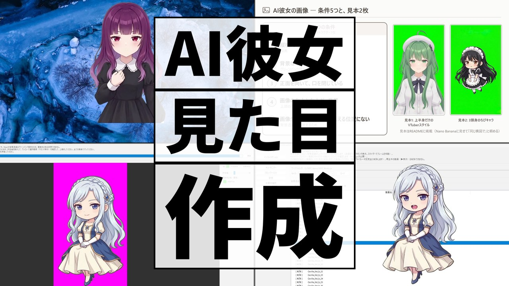</a></td></tr>
</table>

<p align="center"><b>解説動画</b>（約17分・クリックするとYouTubeで開きます）<br>セットアップから素材作成、AGへの組み込みまで</p>

## MotionPNGCreator とは

MotionPNGCreator（MPC）は、AI彼女アプリ [Artificial Girlfriend](https://github.com/ARP224/ArtificialGirlfriend)（AG）で使用するキャラクターアニメーション素材を量産するためのプログラムです。AGのデスクトップに現れるキャラクターの「動く姿」——髪が揺れ、身体が動き、声に合わせて口が動くループ動画素材（モーション素材）——を、このツールで作ります。

用意するのは、**キャラクター1体につき1枚の画像と、Vidu APIキー**だけ。動画生成AIのViduで画像からループ動画を量産し、SAM3（Metaの画像セグメンテーションAI）で口を消して背景を透過し、口パク用の口の位置データまで自動で仕上げます。キャラクター×モーションの組み合わせを一晩まとめて無人生成する、そのための道具です。

MPCは、rotejin氏の [MotionPNGTuber](https://github.com/rotejin/MotionPNGTuber) を原作に、kazuya-bros氏がSAM3を組み込んだ [MouthSpriteExtractor-SAM3](https://github.com/kazuya-bros/MouthSpriteExtractor-SAM3) を経て、AG用の素材作成に合わせて作り変えたものです（系譜の全体は「[プロジェクトについて](#プロジェクトについて)」のライセンス・謝辞にまとめてあります）。

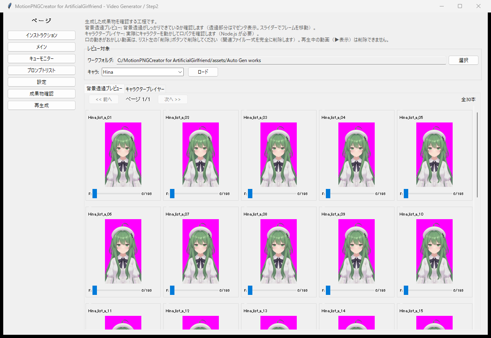

- 生成できるのは、キャラクターごとの**Motionフォルダ**です。AGのキャラクター1体を動かすのに必要な素材が、1つのフォルダにまとまっています:

  ```
  Aya/                    ← Motionフォルダ（フォルダ名 = キャラクター名）
  ├── Aya_list_a_01.webm  ← 口消し済みの透過ループ動画（モーションの数だけ入ります）
  ├── Aya_list_a_01.json  ← 口の位置データ（動画と同名・口を描く位置を記録）
  └── mouth/              ← 口素材（開いた口・閉じた口などの口画像）
  ```
- 作ったMotionフォルダはAGの `MotionPNGPlayer/Asset/` に入れるだけで、AGのキャラクターがその姿で動き出します（手順は「[素材をAG本体へ入れる（仕上げ）](#素材をag本体へ入れる仕上げ)」）

> [!NOTE]
> まず素材がどう動くかを見たい場合は、AG本体に同梱されているサンプルMotionフォルダをお試しください。本リポジトリは素材を「作る」側のツールです。

**目次**

- [MotionPNGCreator とは](#motionpngcreator-とは)
- [モーション素材作成までの流れ](#モーション素材作成までの流れ)
- [作成したモーション素材が動く仕組み](#作成したモーション素材が動く仕組み)
- [要求スペック](#要求スペック)
- [データとプライバシー](#データとプライバシー)
- [セットアップ](#セットアップ)
- [Step 1: 素材準備（Asset Preparer）](#step-1-素材準備asset-preparer)
- [Step 2: 動画生成（Video Generator）](#step-2-動画生成video-generator)
- [素材をAG本体へ入れる（仕上げ）](#素材をag本体へ入れる仕上げ)
- [困ったときは](#困ったときは)
- [アップデートとアンインストール](#アップデートとアンインストール)
- [プロジェクトについて](#プロジェクトについて)

## モーション素材作成までの流れ

MPCは、2つのGUIツールの二段構成です。

1. **Asset Preparer（Step 1・素材準備）** — 量産の前の事前加工です。キャラクター画像を整え（リスケール・背景の緑化・口消し）、SAM3で目と口の位置を検出し、口素材を抽出して、量産に必要な材料一式をそろえます
2. **Video Generator（Step 2・動画生成）** — 量産の工程です。キャラクター×プロンプトの組み合わせでViduに動画を一括発注し、生成された動画を1本ずつトラッキング→口消し→背景透過して、完成素材に仕上げます

Step 1で1キャラクターぶんの材料を作れば、Step 2ではそのキャラクターの動画を何本でも量産できます。

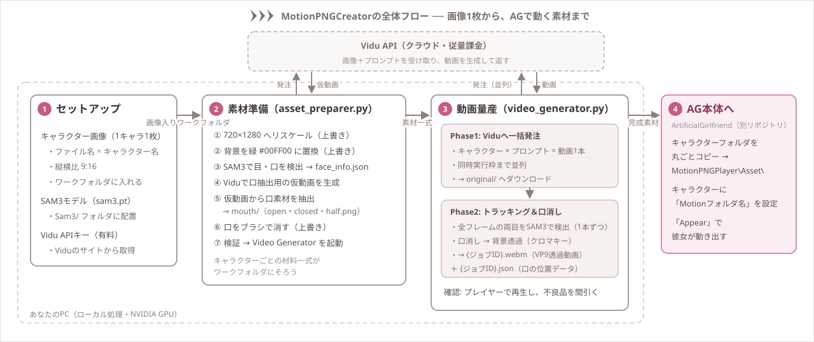

## 作成したモーション素材が動く仕組み

作成したモーション素材が、AGでどう動くのかを説明します。AGのMotionPNGPlayer（MPC同梱の確認用プレイヤーも同じ仕組みです）は、Motionフォルダの3つの素材を組み合わせて再生します。

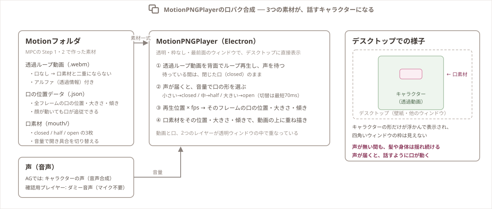

## 要求スペック

- **OS: Windows 11** — 開発・動作確認はWindows 11で行っています（他OSは未検証です）
- **GPU: NVIDIA GPU（CUDA対応）必須** — 口消しとトラッキングに使うSAM3を、PyTorchのCUDA版（12.6）で動かすためです。CPUでも動く可能性はありますが、極端に遅く、未検証・サポート対象外です。AMD / Intel GPUは使用できません。CUDA / cuDNNは環境構築（uv sync）で自動導入されるので、用意するのはNVIDIAドライバだけです
- **ディスク空き容量: 10GB以上を推奨** — 実使用は約8GB（Python環境 約4.5GB＋SAM3モデル 約3.5GB）です。これとは別に、生成した素材のぶんだけワークフォルダが育っていきます

## データとプライバシー

- **テレメトリ・利用統計・自動更新チェックはありません**
- キャラクター画像・生成した素材はワークフォルダに、設定（APIキーを含む）はリポジトリのフォルダ内に保存されます。すべてあなたのPCの中で完結し、MPCがどこかへ同期することはありません
- 外部に送られるのは、動画生成のために**Vidu APIへ送るキャラクター画像とプロンプトだけ**です（取り扱いは[Vidu](https://www.vidu.com/)の規約に従います）。このほかの通信は、セットアップ時の各公式サイトからのダウンロードだけです

## セットアップ

> [!TIP]
> ここから素材作成までの手順は、[解説動画](https://youtu.be/PXFL_PeD5jo)でも見られます。

インストールからワークフォルダの用意まで——MPCを起動する前の準備を、この章でやります。

### インストール

1. ターミナル（コマンドプロンプトまたはPowerShell）でリポジトリをクローンします。[Git](https://git-scm.com/) が必要です（未導入なら先にインストールしてください）
   ```powershell
   git clone https://github.com/ARP224/MotionPNGCreator-for-ArtificialGirlfriend.git
   ```
2. **`Installer MotionPNGCreator for AG.bat` をダブルクリック**します。下表のソフトウェアが自動で導入されます（導入済みの項目はスキップされるので、何度実行しても安全です）

| 導入されるもの | 用途 |
|---|---|
| [uv](https://docs.astral.sh/uv/) | Python 3.12本体と依存パッケージの管理 |
| Git | 依存パッケージ（CLIP）の取得 |
| ffmpeg | 透過WebM出力・音声処理・プレビュー |
| Node.js (LTS) | 確認用プレイヤー（Electron）の起動 |
| Pythonパッケージ一式（`uv sync`） | PyTorch CUDA 12.6版など。**数GBのダウンロードが発生します** |
| プレイヤー依存パッケージ（`npm install`） | Electron本体 |

インストーラーの使用は必須ではありません。あくまで楽にインストールするための補助なので、winget や各公式サイトから手動で導入しても構いません。

<details>
<summary>手動セットアップ（インストーラーが中でやっていること）</summary>

Git / ffmpeg / Node.js は導入済みで、PATHが通っている前提です。ffmpegは libvpx-vp9 エンコーダを含むビルド（winget の Gyan.FFmpeg など）が必要です。

```powershell
# uvのインストール（未導入の場合。実行後にターミナルを開き直す）
powershell -ExecutionPolicy ByPass -c "irm https://astral.sh/uv/install.ps1 | iex"

# リポジトリのフォルダで依存関係を同期
uv sync

# プレイヤー（Electron）
cd MotionPNGTuber_Player
npm install

# 動作確認
uv run python -c "import torch; print('CUDA:', torch.cuda.is_available())"
```
</details>

### SAM3モデルを配置する

SAM3は、Metaが公開している画像セグメンテーションAIで、**MPCの中核部品です**。素材準備での目・口の検出も、量産中のトラッキングと口消しも、すべてSAM3の上で動くため、モデルが無いとMPCは機能しません。モデルファイルは承認制で配布されているため、この1手順だけは手動になります。

1. [HuggingFace（facebook/sam3）](https://huggingface.co/facebook/sam3)でアクセス申請し、承認を受けます（おそらく数時間で申請は通ると思います）
2. 承認後、ファイル一覧の **`sam3.pt`** をダウンロードして、リポジトリ内の `Sam3/` フォルダに置きます（詳細は [Sam3/README.txt](Sam3/README.txt)）

### Vidu APIキーを用意する

[Vidu](https://www.vidu.com/)は、画像から動画を生成するクラウドAIです。APIキーは、その従量課金（クレジット制）の利用証にあたります。開発者向けページ（[platform.vidu.com](https://platform.vidu.com/)）でアカウントを作成し、APIキーを発行してください。発行したキーは、後で「[Step 1](#step-1-素材準備asset-preparer)」の最初のタブでMPCに保存します。費用の目安は「[Step 2](#step-2-動画生成video-generator)」の設定の節にまとめてあります。

> [!CAUTION]
> APIキーはリポジトリのフォルダ内の `.batch_settings.json` に**平文で保存**されます（Gitには入りません）。設定ファイルの中身を他人に見せない・配信や画面共有に映さないよう注意してください。

### キャラクター画像を用意する

素材の元になる画像の条件です。ここが仕上がりを左右します。

- **1キャラクター = 1枚**。正面を向いて、口を閉じた画像を推奨します
- **ファイル名がそのままキャラクター名になります**。日本語も使えます。使えないのは、ファイル名に使えない記号 `\ / : * ? " < > |` と `#` `%`、先頭・末尾のスペースと末尾のドット、Windowsの予約名（CONなど）、60文字を超える名前です（タブ⓪のチェックリストで理由が表示されます）。例: `Aya.png`、`ゆず.png`
- **縦横比は 9:16**（縦長）。ずれた画像は720×1280への変換で歪みます
- **背景は単色にしてください（グリーンバック推奨）**。背景色の自動検出は**画像の左上・右上の角**を見るため、上部の両角が背景になっている構図にしてください
- **画像生成AIの透かし（ウォーターマーク）は除去してください**。背景透過に影響します。規約上、透かしを消してよい画像を使ってください（Windowsフォトの編集「AI消しゴム」で簡単に消せます）

作者は Google の Nano Banana で生成しています。下の見本画像を渡して「同じ構図で」と指示すると、条件を満たした画像を楽に作れます。見本は、上半身だけのVTuberスタイルと、3頭身のちびキャラ（全身）の2パターンです。

<p>
  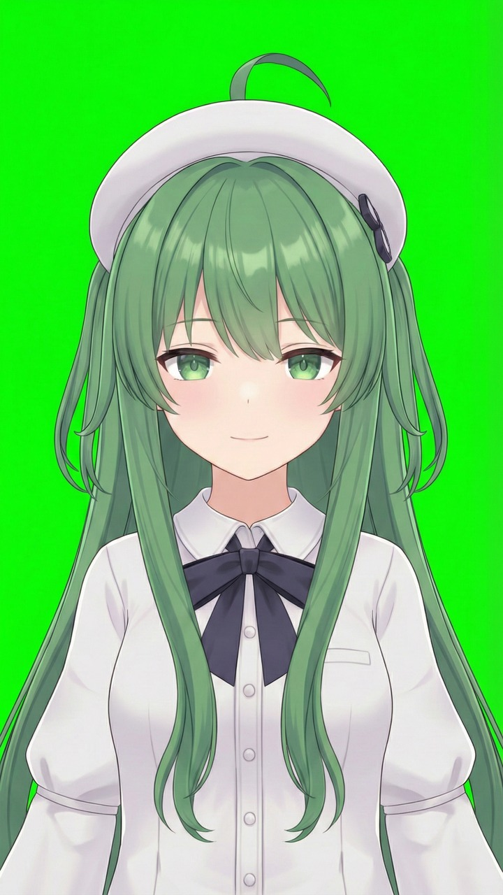
  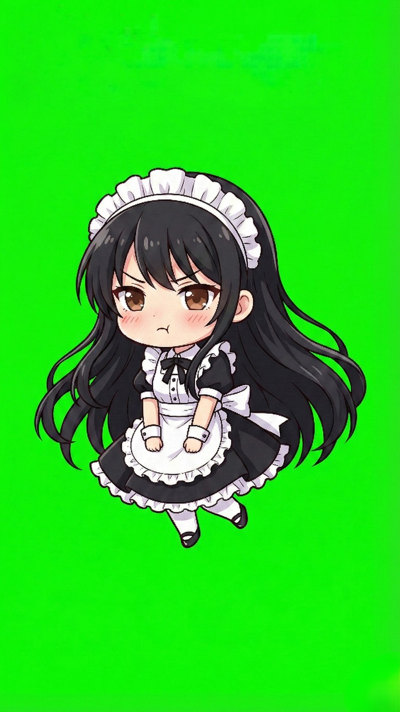
</p>

> [!IMPORTANT]
> Step 1の一部の工程（①リスケール・②背景色置換・⑥口消し）は、**画像を直接上書きします**。元の画像が必要な場合は、ワークフォルダに入れる前にコピーを別の場所へ保管してください。

### ワークフォルダを作る

PCの好きな場所に**ワークフォルダ**（今回の素材生成に使うフォルダ）を作り、キャラクター画像を入れます。

```
WorkFolder/          ← 名前も場所も自由（日本語も可）
├── Aya.png          ← キャラクター画像（1キャラ1枚）
└── Mia.png
```

これで起動前の準備は完了です。次の章から、MPCを起動して素材を作っていきます。

## Step 1: 素材準備（Asset Preparer）

ここからは、MPCを起動しての作業です。**`Start_Asset_Preparer(step1).bat` をダブルクリック**すると、素材準備GUI（Asset Preparer）が起動します（コンソールは表示されません。動作ログを見たい場合は `uv run python asset_preparer.py` で起動してください）。

タブを**⓪から⑦まで左から順に**進めます。①③④は全キャラクターまとめて一括実行の工程、②⑤⑥は1キャラクターずつ処理して全キャラクター分繰り返す工程です。

### ⓪ インストラクション

ワークフォルダの指定・APIキーの保存・事前チェックを行うタブです。

1. 「ワークフォルダ選択」で、セットアップで作ったワークフォルダを選びます
2. Vidu APIキーを入力して「保存」します
3. **事前準備チェックリストの項目が全て ✓ になっているか確認します**。✗ が残っていれば、その項目の準備が未完了です（△は警告——Gitは環境構築後は無くても動作し、Node.jsはプレイヤーを使う時だけ必要です）

- 言語は「言語 / Language」で日本語 / 英語を切り替えられます（反映は再起動後）

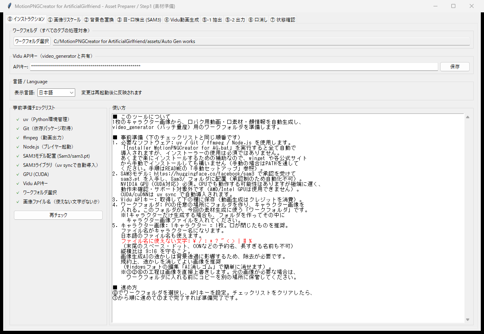

### ① 画像リスケール

画像を720×1280にリスケールして、これから生成する動画の解像度に合わせる工程です。

- 「リスケール実行」を押します（ワークフォルダ直下の画像がまとめて処理されます）
- 9:16から大きくずれた画像は警告が出ます。そのまま進めると歪むので、画像を差し替えるか切り抜いてください

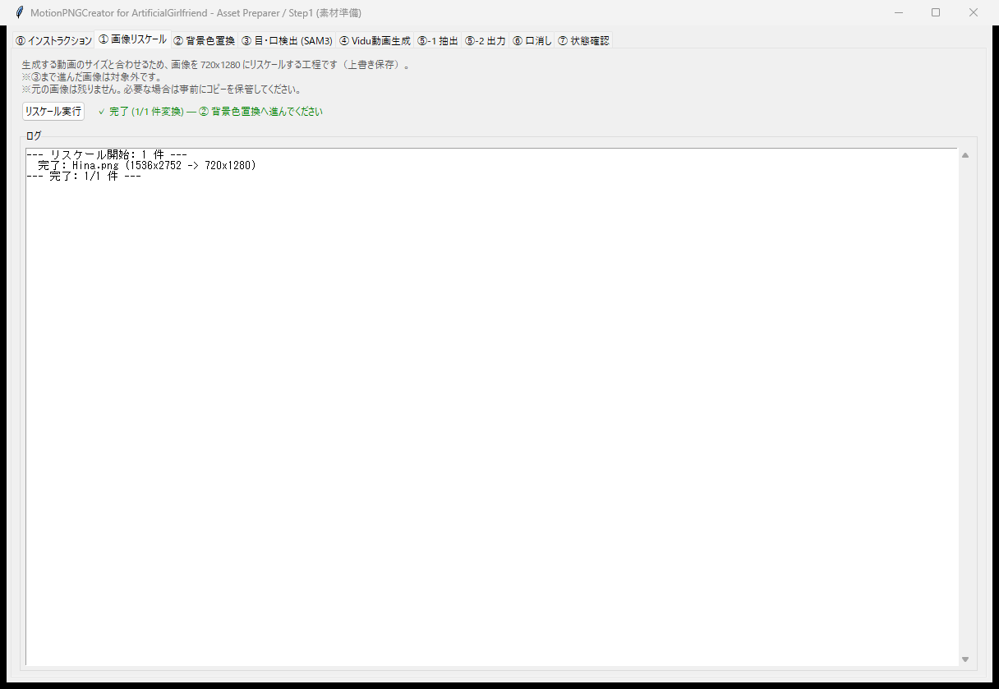

### ② 背景色置換

背景を純粋な緑（#00FF00）に変換して、少しでも動画生成後の背景透過の精度を上げる工程です。

1. 画像を選ぶと、背景として検出された範囲が**マゼンタ（ピンク）で表示**されます
2. 背景部分が完全にマゼンタで覆われたことを確認します
3. 「置換して上書き保存」を押します
4. これをワークフォルダ内の全てのキャラクターで繰り返します

- プレビュー画像を**左クリック**すると、クリックした箇所の色が基準色になります
- 許容値を変更すると、背景として判定する色範囲を変更できます

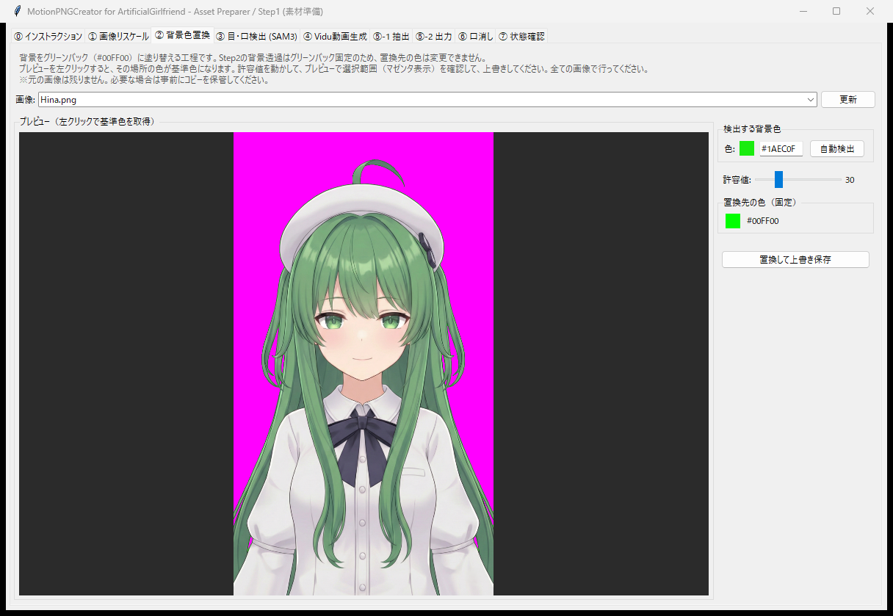

### ③ 目・口検出 (SAM3)

キャラクターの目と口の位置関係をSAM3で抽出する工程です。

- 「検出実行」を押します（全キャラクター一括処理）
- ここで検出した口の位置が、量産時の口消しと口合成の基準になります
- 処理完了後、キャラクターの目と口の位置が正しく検出できているか、プレビューで確認します
- 検出が終わった画像は、キャラクター名のフォルダへ自動で移動します（検出結果は `{キャラクター名}_face_info.json` に保存されます）
- 検出をやり直したいときは、キャラクターフォルダ内の `_face_info.json` を削除してから再実行します

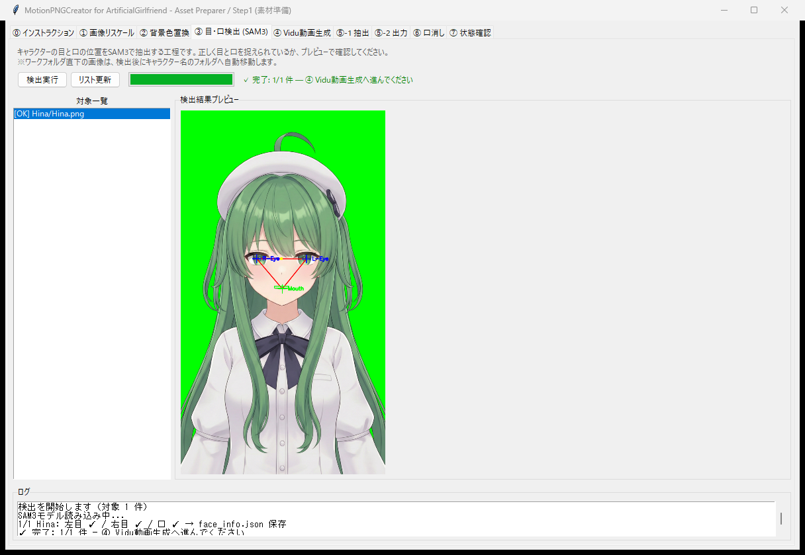

### ④ Vidu動画生成

⑤で口の画像を抽出するための仮動画を、キャラクターごとに1本ずつ生成する工程です。

- 「開始」を押します。推定クレジットが表示され、確認ダイアログのあとに生成が始まります
- 動画は `{キャラクター名}/{キャラクター名}.mp4` に保存されます
- 解像度は720p固定です（①のリスケールと量産動画に合わせるため）

> [!NOTE]
> この工程からViduのクレジットを消費します（既定設定のviduq2-pro-fast・4秒で1本14クレジット）。生成済みキャラクターは既定でスキップされるので、途中から再実行しても二重課金にはなりません。

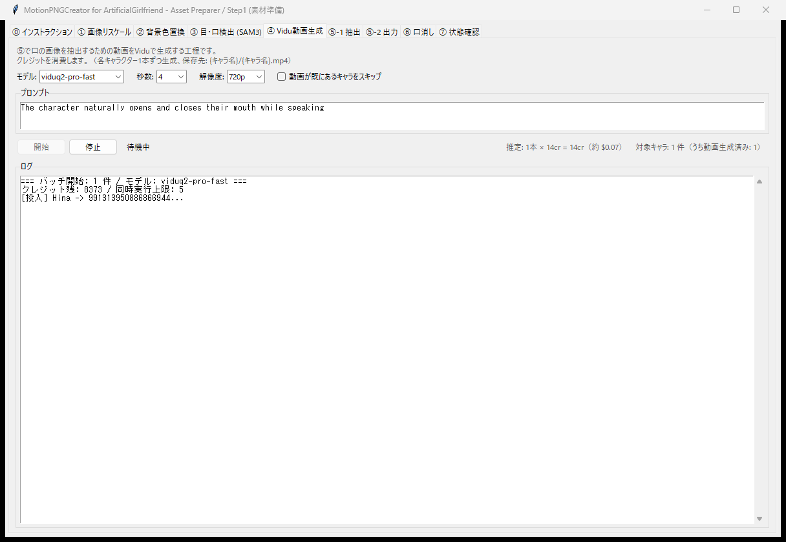

### ⑤-1 抽出

④で生成した動画からSAM3で口素材を抽出する工程です。

1. キャラクターを選択します
2. 「解析開始」を押します
3. 解析が終わると候補が並ぶので、**Open**（開いた口）/ **Closed**（閉じた口）/ **Half**（半開き）として適した画像をそれぞれ選択します
4. 「⑤-2へ進む」を押します

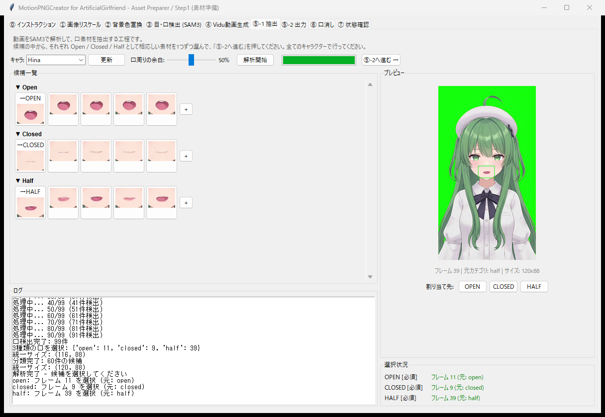

### ⑤-2 出力

⑤-1で抽出した口画像を加工して、出力して保存する工程です。

1. 膨張などのパラメータをいじって、口素材の範囲ギリギリが選択された状態にします（プレビューの市松模様は透明部分です）
2. 「PNG出力」を押します（`{キャラクター名}/mouth/` に open.png / closed.png / half.png が保存されます）
3. ⑤-1に戻って、次のキャラクターへ進みます

- 位置調整と大きさは基本的に触る必要はありません。口の位置が偏っていたら直さないと、合成する口の位置に影響します

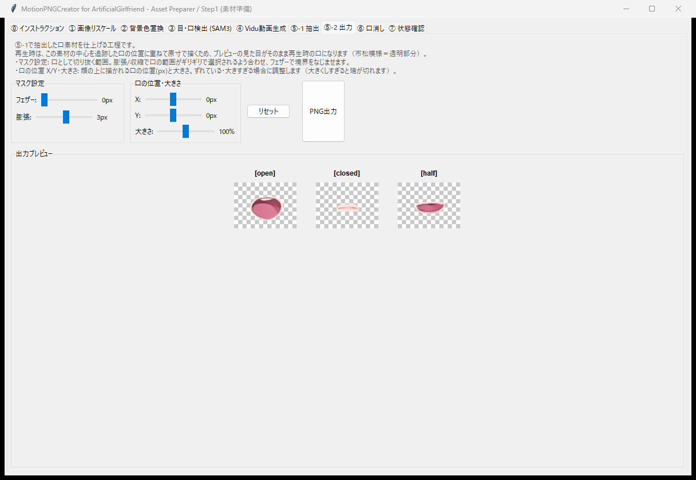

### ⑥ 口消し

キャラクター画像の口を消して、口合成の邪魔にならないようにする工程です。口なし画像で動画を生成すると、後工程の口消しが安定するためです。

1. キャラクターを選択します（口の周辺が自動で拡大表示されます）
2. 右側のプレビューで、口部分を埋める色を**右クリックで採取**します
3. **左ドラッグで口を塗りつぶして**消します
4. 「上書き保存」を押します
5. これをワークフォルダ内の全てのキャラクターで繰り返します

- 塗りをやり直したいときは「編集を破棄」で保存前の状態に戻せます
- うまく消えない場合は、Windowsフォトの編集「AI消しゴム」で口を消して上書き保存してください

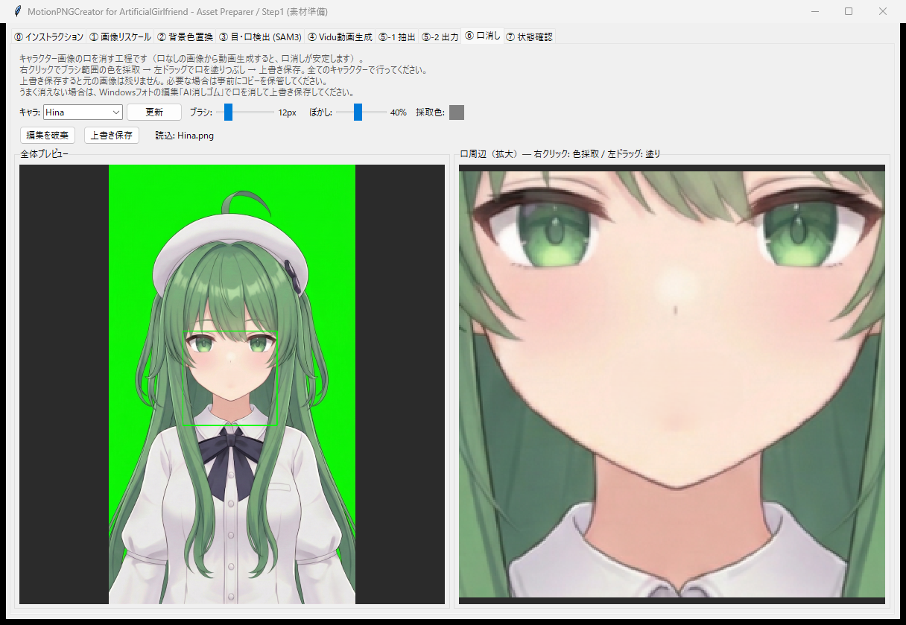

### ⑦ 状態確認

これまでの工程が問題なく行われたかを確認する工程です。

1. 全てのキャラクターが「OK」になっているか確認します（問題があれば「問題」列に理由が表示されます）
2. 「準備完了 → video_generator を起動」をクリックします（Video Generatorが起動し、Asset Preparerは閉じます）

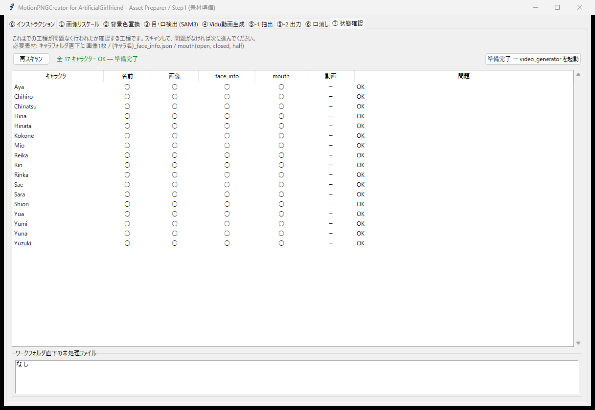

これでStep 1・素材準備は終わりです。

## Step 2: 動画生成（Video Generator）

ここからが量産の工程です。ページを「設定 → プロンプトリスト → メイン」の順に進めて生成を開始し、「成果物確認」で仕上がりを確かめて、不良品を間引きます。

### 生成前の設定（「設定」ページ）

- **動画生成設定** — どのモデルで何秒の動画を生成するかを指定します。お好みで。解像度は720p固定です（Step 1のリスケールと合わせるため）
- **背景透過設定** — 背景として判定する色範囲（許容値）の設定です。Step 1の②背景色置換で使った許容値を参考に
- **GPU休憩設定** — GPUのクールダウンのために、何本生成するごとに何秒処理を停止するかを指定します。通常はそのままでいいです
- **トラッキング設定** — 口位置の動きの平滑化です。ここも通常はそのままで、生成した動画に問題があった場合に調整すれば十分です

費用の目安: 1本あたりの消費クレジットはモデルと秒数で決まります。既定のviduq2-pro-fast・5秒なら**1本16クレジット**で、画面の見積もり表示は1クレジット=0.005ドルで換算しています（実際の購入価格・料金体系は[Vidu](https://www.vidu.com/)で確認してください）。

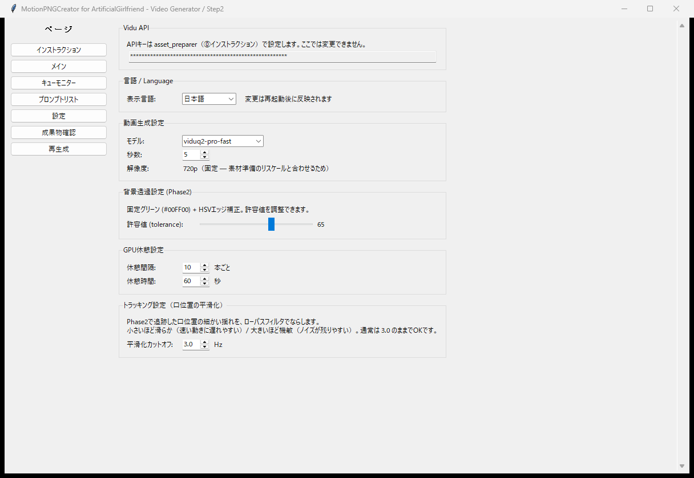

### プロンプトリストを作る（「プロンプトリスト」ページ）

キャラクターにさせたい動きを、プロンプトのリストとして用意します。

- プロンプトを手入力、もしくは「ファイルから読み込み」で入力し、「保存」します
- **1プロンプト = 1動画**です。リストに30プロンプトを入れると、キャラクター1体あたり30本の動画を生成することになります
- プロンプトリストはA〜Eまであって、5つまで保存できます（1リスト最大50件）

> [!IMPORTANT]
> 全てのプロンプトの中には、必ず「**口を生成しない**」（例: `Do not generate a mouth.`）と「**背景を緑のまま保つ**」（例: `Keep the solid bright green background.`）を意味する文言を含めてください。前者が無いと口の消え残りが増え、後者が無いと背景が抜けません。

- 生成AIにプロンプトリストを作ってもらい、「ファイルから読み込み」で読み込むのがおすすめです。読み込めるファイルは次の2形式です

  **JSONの文字列配列**（拡張子 .json）:

  ```json
  [
    "waving hand. Do not generate a mouth. Keep the solid bright green background.",
    "nodding slowly. Do not generate a mouth. Keep the solid bright green background."
  ]
  ```

  **テキスト（1行1プロンプト・拡張子 .txt）** — 行頭の番号や箇条書き記号（`1.` `-` `・` など）は自動で取り除かれます:

  ```text
  1. waving hand. Do not generate a mouth. Keep the solid bright green background.
  2. nodding slowly. Do not generate a mouth. Keep the solid bright green background.
  ```
- 初回起動時には、作者が実際に量産に使ったプロンプト30本×2セットがList A / Bにセットされています。まずはそのまま使えます
- **キャラクターが後ろを向くような動作（目が隠れる動作）は対応できません**。口の位置は毎フレームの目の検出から割り出しているためです

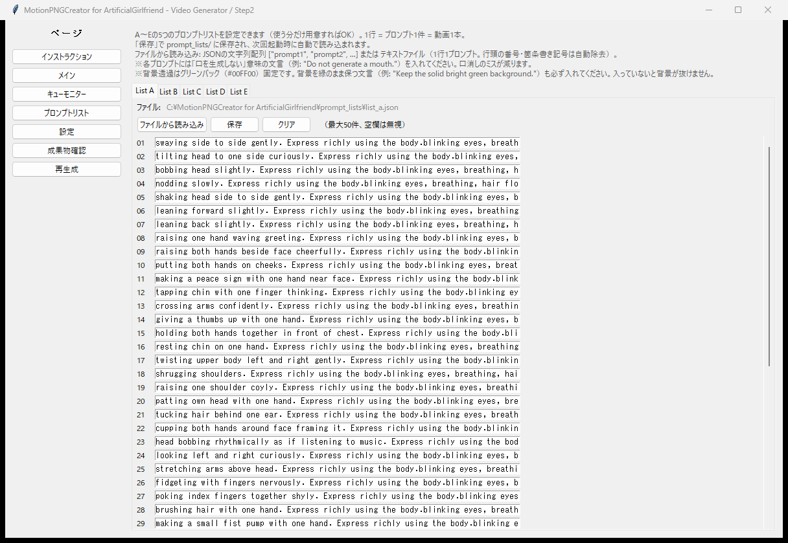

### 生成開始（「メイン」ページ）

1. キャラクター一覧で、キャラクターごとにどのプロンプトリストで生成するかをチェックします
2. 「素材チェック＆見積もり」をクリックして、素材の不足がないか・ViduAPIのクレジットが足りるかを確認します
3. 「開始」で生成が始まります（本数と推定クレジットの確認ダイアログが出ます）

- 状態が NG のキャラクターは素材が不足しています（カーソルを合わせると下部に理由が表示されます）。Step 1に戻って足りない素材を補完してください

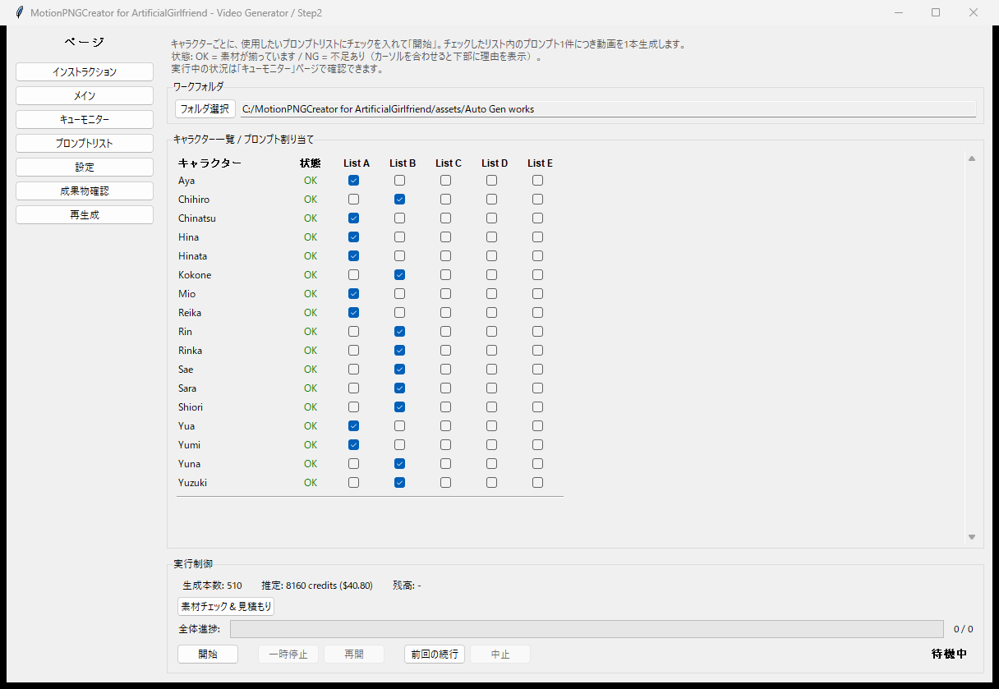

### 生成中（「キューモニター」ページ）

- かなり時間のかかる処理です。生成した動画の全フレームをSAM3で解析して口の位置を追跡するため、動画1本ごとにGPU処理の時間がかかります。作者は500本を15時間程度かけて生成しました（使用GPUはRTX 4070 SUPER）
- 進捗はキューモニターで確認できます。**Phase1**（Viduでの動画生成）はViduの同時実行枠まで並列で進み（通常5本）、**Phase2**（トラッキング＆口消し）はGPU処理のため1本ずつ進みます
- 残高が1本分を下回ると自動で一時停止します。クレジットを追加してから「再開」してください
- 中断しても大丈夫です。進捗はワークフォルダの `batch_state.json` に保存されていて、「前回の続行」でいつでも続きから再開できます

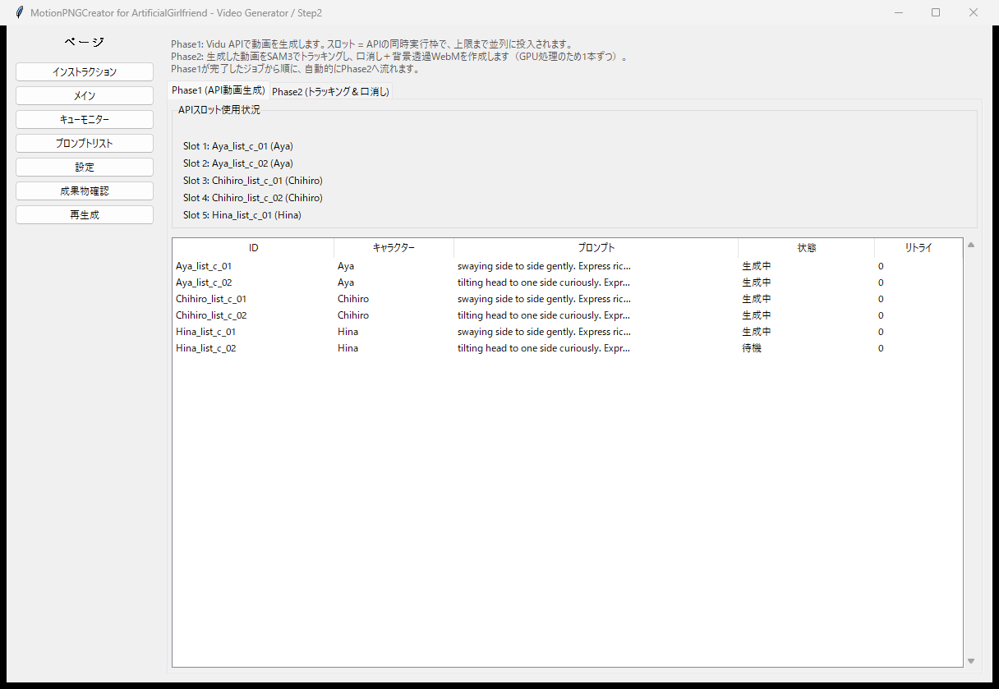

### 生成完了後（「成果物確認」ページ）

1. 成果物確認ページを開いて、キャラクターを選択します
2. **背景透過プレビュー**で、背景透過が機能しているか確認します（背景がマゼンタ（ピンク）で表示されていればOK——マゼンタ＝透明になった部分です）
3. **キャラクタープレイヤー**の「再生開始」で、実際の動きと口パクを確認します（同梱の確認用プレイヤーが起動し、マイク不要のダミー音声で口パクを再現します）。不良品は「削除」をクリックして消すことができます

> [!NOTE]
> 全ての動画で口消し処理が上手くいくわけではありません。合成される口が少し振動したり、少し曲がったりする不良品が10本に1本くらいの割合で発生します。それらは間引くことができます。どこまで許容するかはあなた次第です。作者はほとんど許容しています。

> [!WARNING]
> 「削除」は動画・トラッキングデータ・生成元動画の一式を**完全に削除します**（ゴミ箱には入りません。元に戻せません）。

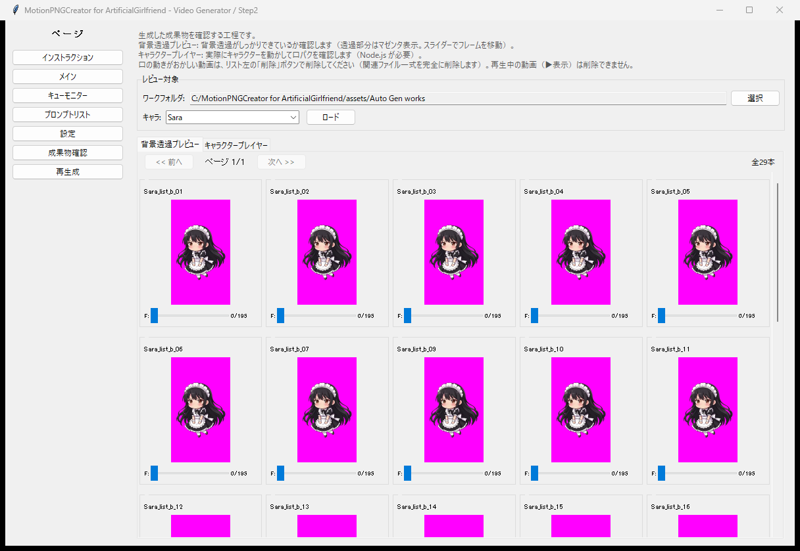

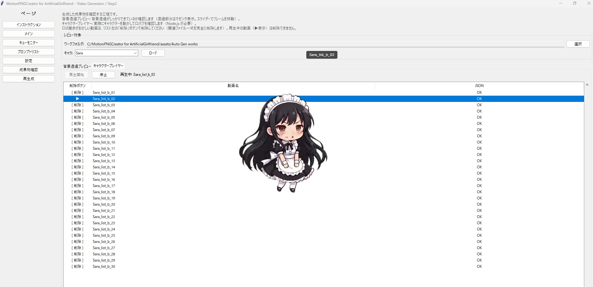

> [!NOTE]
> 口合成が失敗している瞬間。このようなものがあれば必要に応じて間引きます。

### 再生成（「再生成」ページ）

失敗した動画や品質の低い動画の、トラッキング＆口消し（Phase2）だけをやり直すページです。Viduは使わないので、**クレジットは消費しません**。

1. 再生成ページで、再生成するキャラクターを指定します（既定では失敗した動画だけが対象です）
2. 「再生成 開始」で、トラッキング＆口消し処理をやり直します

- 単なるGPUエラーなら、そのままやり直せば良品が生成されます
- 背景範囲の問題なら、設定ページの背景透過設定を変更して再生成すれば、良品が生成されます
- 各キャラクターフォルダ内の `original` フォルダ（Vidu生成動画の原本）を消すと再生成できません。ワークフォルダ側の `original` は残しておいてください

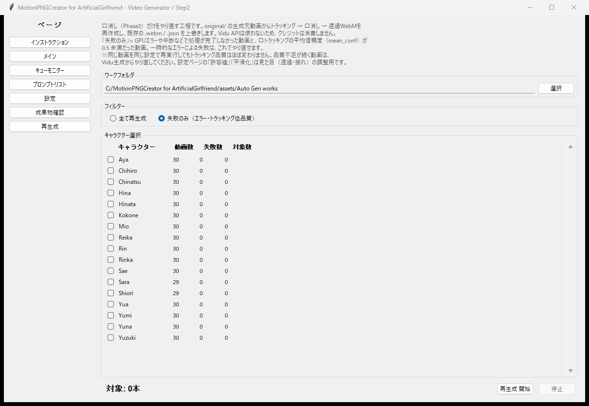

## 素材をAG本体へ入れる（仕上げ）

最後に、完成した素材をAG本体に設置します。

1. ワークフォルダの中のキャラクターフォルダを、AG本体の `ArtificialGirlfriend\MotionPNGPlayer\Asset` に貼り付けます
   ```
   ArtificialGirlfriend\
   └── MotionPNGPlayer\
       └── Asset\
           └── Aya\        ← ワークフォルダからキャラクターフォルダごとコピー
               ├── Aya_list_a_01.webm   ← モーション動画（生成した本数ぶん）
               ├── Aya_list_a_01.json   ← 同名の口の位置データ
               ├── mouth\               ← 口素材
               └── original\ ほか       ← AGでは使いません（下記）
   ```
2. AG本体でキャラクターに「Motionフォルダ名」を指定し、Utility Panelの「Appear」ボタンで、彼女がその姿でデスクトップに現れます

- コピー先の `original` フォルダはVidu生成動画のバックアップです。AG本体では不要なので削除して問題ありません。そのままでも多少の容量を食うだけで無害です（`_metrics.json` などそのほかのファイルも、置いたままで無害です）
- **ワークフォルダ側は消さずに残しておくのがおすすめです**。再生成や追加生産の拠点になります
- 日本語名のキャラクターフォルダを別のPCへ運ぶときは、zipにせずフォルダのまま（共有フォルダ・OneDrive・USBなど）で運んでください。zipは作成側と展開側で文字コードが合わないとフォルダ名が文字化けします（Macの「圧縮」で作ったzipをWindowsで展開した例で実測）

お疲れ様でした。

## 困ったときは

うまく動かないとき・仕様か不具合か迷ったときは、まずここを確認してください。

### セットアップまわり

- **インストーラーが失敗する・途中で止まる** — ネットワークエラーならそのまま再実行してください（導入済み項目はスキップされ、続きから進みます）。「winget が見つかりません」と出る場合は、Microsoft Storeで「アプリ インストーラー」を更新してください。入れた直後のソフトが認識されない場合は、PCを再起動してから再実行してください
- **uv sync が失敗する** — `uv cache clean` してから `uv sync` をやり直してください
- **CUDAが認識されない** — `uv run python -c "import torch; print(torch.cuda.is_available())"` が `False` の場合、NVIDIAドライバを更新してください
- **SAM3モデルが読み込めない** — `Sam3/sam3.pt` にファイルがあるか、HuggingFaceのアクセス承認が済んでいるかを確認してください
- **ffmpeg が見つからない／WebMを出力できない** — 口消しWebMの出力には libvpx-vp9 エンコーダ入りのffmpegが必要です。インストーラーが導入するffmpegを使ってください

### 生成まわり

- **起動しない・動作ログを見たい** — `Start_*.bat` はコンソール非表示で起動します。エラーの詳細を見たい場合は、リポジトリのフォルダでターミナルを開き、`uv run python asset_preparer.py`（または `uv run python video_generator.py`）で起動してください
- **背景がうまく抜けない** — ①プロンプトに「背景を緑のまま保つ」文言が入っているか ②設定ページの許容値を上げて再生成 ③元画像の透かしが残っていないか、を順に確認してください
- **口が消え残る・口の位置がおかしい** — プロンプトに「口を生成しない」文言が入っているか確認してください。GPUエラー由来なら再生成ページでやり直せます。同じ動画の再生成で品質が変わらない場合は、その動画は諦めて削除するか、Vidu生成からやり直してください
- **プレイヤーが起動しない** — Node.jsがインストールされているか、`MotionPNGTuber_Player/` で `npm install` が済んでいるか（インストーラーが実施します）を確認してください
- **動画の処理が失敗する** — ワークフォルダやリポジトリのパスに、Windowsの標準文字コードで表せない文字（絵文字など）が含まれると、動画処理（OpenCV）が失敗することがあります。日本語は問題ありません（日本語版Windowsで確認済み）。ワークフォルダの選択時に警告が出た場合は、英数字のみのパス（例: `C:\Work`）に移してください

解決しない不具合は[Issues](https://github.com/ARP224/MotionPNGCreator-for-ArtificialGirlfriend/issues)へ報告してください。何をしたら何が起きたかと、`uv run python ...` で起動したときのコンソール出力を添えてもらえると、調査が速く進みます。使い方の質問や雑談は[Discussions](https://github.com/ARP224/MotionPNGCreator-for-ArtificialGirlfriend/discussions)へどうぞ。

## アップデートとアンインストール

### アップデート

1. GUIを閉じる
2. リポジトリのフォルダで `git pull`
3. `Installer MotionPNGCreator for AG.bat` を再実行（差分だけ処理されます）

設定・プロンプトリスト・ワークフォルダの素材はそのまま残ります。

更新情報は[GitHub Releases](https://github.com/ARP224/MotionPNGCreator-for-ArtificialGirlfriend/releases)でお知らせします。リポジトリを **Watch > Custom > Releases** にしておくと通知が届きます。

### アンインストール

本ツールは、アプリ本体をリポジトリのフォルダの外に配置しません。

1. **アプリ本体** — リポジトリのフォルダを削除するだけです（Python環境 `.venv`・設定ファイル・プレイヤーの `node_modules` もすべてフォルダ内にあります）。ワークフォルダは自分で選んだ場所にあるので、必要に応じて削除してください
2. **インストーラーが導入した共用ツール**（uv / Git / ffmpeg / Node.js） — 他のアプリでも使われる汎用ツールのため、自動では削除しません。不要な場合のみ手動で削除してください:
   ```powershell
   winget uninstall Git.Git
   winget uninstall Gyan.FFmpeg
   winget uninstall OpenJS.NodeJS.LTS
   # uv本体・uvが管理するPython・キャッシュ
   Remove-Item -Force "$env:USERPROFILE\.local\bin\uv.exe", "$env:USERPROFILE\.local\bin\uvx.exe"
   Remove-Item -Recurse -Force "$env:APPDATA\uv", "$env:LOCALAPPDATA\uv"
   ```
3. **その他の痕跡（任意）** — `%APPDATA%\Ultralytics`（SAM3実行ライブラリが作る設定フォルダ）

## プロジェクトについて

### 使用技術

| 領域 | 使用技術 |
|---|---|
| 言語・基盤 | Python 3.12 / PyTorch（CUDA 12.6） / [uv](https://docs.astral.sh/uv/) |
| GUI | tkinter |
| 目・口の検出 | [SAM3（Meta）](https://huggingface.co/facebook/sam3) / [Ultralytics](https://github.com/ultralytics/ultralytics) |
| 動画生成 | [Vidu API](https://www.vidu.com/) |
| 映像処理 | OpenCV / ffmpeg（libvpx-vp9・VP9アルファ付きWebM） |
| 確認用プレイヤー | Electron 28 / websockets（GUIとの連携） |

### 開発の経緯と課題

元々、[Artificial Girlfriend](https://github.com/ARP224/ArtificialGirlfriend)（AG）に、このようなモーション素材によるキャラクタービジュアルを実装することは考えていませんでした。VRMも触ったことのない私には、難しいだろうと思い込んでいたからです。しかし、2025年の末にrotejin氏が[MotionPNGTuber](https://github.com/rotejin/MotionPNGTuber)をリリースされて、その後すぐに、kazuya-bros氏が[MouthSpriteExtractor-SAM3](https://github.com/kazuya-bros/MouthSpriteExtractor-SAM3)をリリースされたことで、一気に出来そうかもという気持ちが湧いてきて、ここまで来ることができました。

私がMPCに求めていたことは、とにかく大量のキャラクターモーション素材を簡単に自動生成することでした。画像1枚とVidu APIキーを用意すれば、処理に時間はかかりますが、量産できるので、その目的は達成できたと思います。

とはいえ、まだまだクオリティは十分ではないと感じています。ある程度、口が振動したり、口の位置がズレる不良品が発生しますし、後ろを向けないなどの縛りがありますし、頬にチークを塗っているキャラクターはその色で口を埋めてしまうことがありますし、表情を使った感情表現に対応できていません。

また、最近は、X上で、VRMモデルをAIで作ったという投稿も見かけます。AGのキャラクタービジュアルも、今後、開発を進めるのなら、その方向かもなとも思っています。（まぁ、画像一枚でここまで量産できる手軽さは捨てられない気もしますが）

私個人の実装力と発想力だけでは、限界があります。もし、これを読んでくれている人がいて、このプロジェクトに興味を持ってくれたのなら、プルリクエストを歓迎しますし、何かアイデアをお持ちであれば、それについて[議論](https://github.com/ARP224/MotionPNGCreator-for-ArtificialGirlfriend/discussions)できれば嬉しいです。

最後に、[AG本体のREADME](https://github.com/ARP224/ArtificialGirlfriend/blob/master/README.ja.md#開発の経緯と課題)でも述べましたが、このプロジェクトは人間との恋愛を置き換えることを目的にしてはいません。人との関係を築くのが難しい時期や状況は、誰にでもあると思います。そんなときにAI彼女が傍にいて生活を少し賑やかにしてくれることが安心感になり、その安心感が人との関係に前向きになるきっかけになれば嬉しい、というのが私の考えです。

### 開発に参加する

さらなるAI彼女の可能性を広げる手伝いをしてくれる方を歓迎します。

- Pull Requestは歓迎です。小さな修正は取り込みやすく、大きな変更は先に[Issues](https://github.com/ARP224/MotionPNGCreator-for-ArtificialGirlfriend/issues)で相談してください。挙動に触る変更はメンテナの実機確認を挟むため、取り込みまで時間がかかることがあります（個人プロジェクトのため、返答が遅れることもあります）
- IssueもPRも、日本語・英語どちらでも構いません
- UIの文言（`locales/`）を変更した場合は、`uv run python tools/check_locales.py` で日英の整合を確認してください
- 開発の作法（送る前のチェック・コードの決まりごと・バグ報告の書き方）は [CONTRIBUTING.ja.md](CONTRIBUTING.ja.md) にまとまっています

### 開発者について

アマチュアの個人開発者（日本人）です。XとYouTubeやってます: [X (@RyoAIGF)](https://x.com/RyoAIGF)／[YouTube (@RyoAIGF)](https://www.youtube.com/@RyoAIGF)。

### ライセンス

MotionPNGCreator for ArtificialGirlfriendは、**AGPL-3.0-only**（GNU Affero General Public License version 3）で提供されます（`LICENSE` 参照）。SAM3の実行に使用しているUltralyticsライブラリがAGPL-3.0のため、リポジトリ全体（`MotionPNGTuber_Player/` を含む）がこのライセンスです。

ふつうに使う・自分用に改造する分には、特別な義務はありません。そして、**本ツールで生成した素材（WebM / PNG / JSON）は、このライセンスの対象外です**。プログラムの出力は派生物にあたらないため、生成した素材の利用条件は制約されません。

- 本プロジェクトは、次の3つの上流の派生プロジェクトです。ファイル別の由来と原著作権表示は [NOTICE.md](NOTICE.md) を参照してください
  - [MotionPNGTuber](https://github.com/rotejin/MotionPNGTuber)（MIT License, Copyright (c) 2025 rotejin）
  - [MotionPNGTuber_Player](https://github.com/rotejin/MotionPNGTuber_Player)（MIT License, Copyright (c) 2026 rotejin）
  - [MouthSpriteExtractor-SAM3](https://github.com/kazuya-bros/MouthSpriteExtractor-SAM3)（AGPL-3.0, Copyright (c) 2026 kazuya-bros）
- **SAM3モデルの利用制限** — SAM3の重みはMetaのSAM Licenseの下で配布されており、軍事・兵器・スパイ活動などへの利用が禁止されています。この禁止は素材を生成する過程に適用されます（詳細は [NOTICE.md](NOTICE.md)）
- Vidu APIの利用は[Vidu](https://www.vidu.com/)の利用規約に従ってください

MotionPNGCreator for ArtificialGirlfriendという名称は、このプロジェクトを識別するものです。フォークを公開する場合はご自身の名称へ差し替えてください。

Copyright (C) 2026 Ryo (ARP224)

#### 免責事項

- Vidu APIの**利用料金はご自身の管理**でお願いします。ツールの見積もり・残高チェックは補助であり、料金体系の変更までは追従できません
- 素材・ワークフォルダのデータ消失に備えたバックアップはご自身の責任です
- 生成した素材の利用は、Vidu・SAM3など各サービス・モデルの規約の範囲で行ってください

### 謝辞

MPCは、次の方々の作品の上に成り立っています。

- **rotejin氏**（[MotionPNGTuber](https://github.com/rotejin/MotionPNGTuber)）— 本プロジェクトの原作の作者です。[解説記事（note）](https://note.com/rotejin/n/n2b12c9be0b81)
- **kazuya-bros氏**（[MouthSpriteExtractor-SAM3](https://github.com/kazuya-bros/MouthSpriteExtractor-SAM3)）— 原作にSAM3を組み込んだ、本プロジェクトの直接のフォーク元の作者です
- **Meta**（[SAM3](https://huggingface.co/facebook/sam3)）— 目・口の検出とセグメンテーションのモデル
- **Ultralytics**（[Ultralytics](https://github.com/ultralytics/ultralytics)）— SAM3の実行ライブラリ
- **Vidu**（[vidu.com](https://www.vidu.com/)）— 画像からの動画生成API
- このプログラムの全コーディングを担当した **Claude Code** に
- そして、ここに書ききれなかったものも含め、MotionPNGCreatorの作成に使わせていただいたすべてのものに感謝します
