<p align="right">
  <strong>English</strong> | <a href="./README.ja.md">日本語</a>
</p>

<h1 align="center">MotionPNGCreator for ArtificialGirlfriend<br><sub>One image and one API key — mass-produce your character's moving form</sub></h1>

<p align="center">
  <a href="LICENSE"></a>
  
  
  
  
</p>

<p align="center">
  <a href="https://github.com/ARP224/MotionPNGCreator-for-ArtificialGirlfriend/discussions"><b>Discussions</b></a>｜<a href="https://github.com/ARP224/MotionPNGCreator-for-ArtificialGirlfriend/issues"><b>Issues</b></a>
</p>

---

<p align="center">
  
</p>

<table align="center">
  <tr><th>Video guide</th></tr>
  <tr><td><a href="https://youtu.be/5BIfvkCkGUU">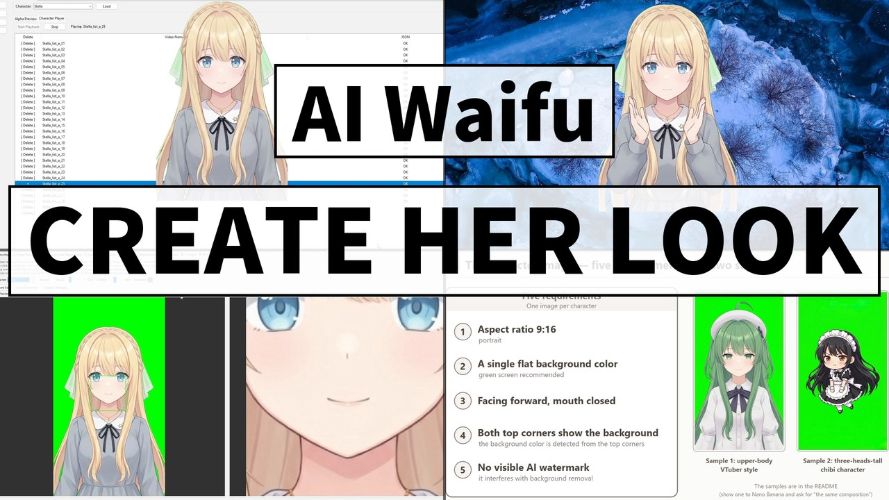</a></td></tr>
</table>

<p align="center"><b>Video guide</b> (about 22 min, opens on YouTube)<br>From setup to creating motion assets and adding them to AG</p>

## About MotionPNGCreator

MotionPNGCreator (MPC) is a program that mass-produces character animation assets for [Artificial Girlfriend](https://github.com/ARP224/ArtificialGirlfriend) (AG), the AI girlfriend app. The "moving form" of the character that appears on AG's desktop — hair swaying, body moving, lips moving with her voice as a looping video asset (a motion asset) — is what this tool creates.

All you need is **one image per character and a Vidu API key**. Vidu, a video-generation AI, mass-produces looping videos from your image; SAM3 (Meta's image-segmentation AI) removes the mouth and makes the background transparent; and the mouth position data for lip-sync is finished automatically. MPC is a tool for generating character × motion combinations unattended, overnight.

MPC is derived from rotejin's [MotionPNGTuber](https://github.com/rotejin/MotionPNGTuber), by way of kazuya-bros's [MouthSpriteExtractor-SAM3](https://github.com/kazuya-bros/MouthSpriteExtractor-SAM3) which integrated SAM3, reworked for creating AG assets (the full lineage is covered in the License and Acknowledgments sections of "[About the Project](#about-the-project)").

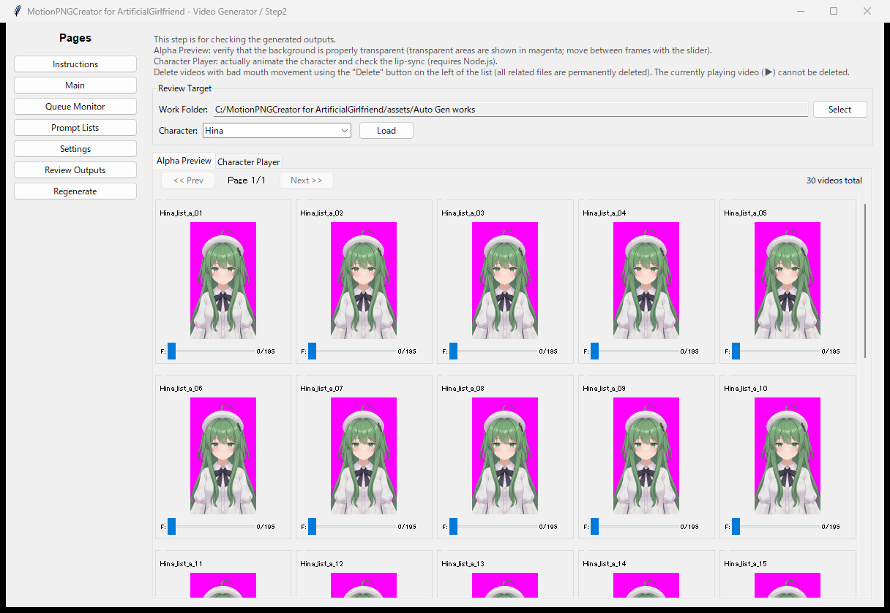

- What you get is a **Motion folder** per character — everything needed to animate one AG character, gathered in a single folder:

  ```
  Aya/                    ← Motion folder (folder name = character name)
  ├── Aya_list_a_01.webm  ← mouth-removed transparent looping video (one per motion)
  ├── Aya_list_a_01.json  ← mouth position data (same name as the video; records where to draw the mouth)
  └── mouth/              ← mouth sprites (open mouth, closed mouth, and so on)
  ```
- Drop the Motion folder into AG's `MotionPNGPlayer/Asset/` and your AG character starts moving in that form (steps in "[Putting the Assets into AG (Finishing)](#putting-the-assets-into-ag-finishing)")

> [!NOTE]
> If you first want to see how the assets move, try the sample Motion folder bundled with AG itself. This repository is the tool that *creates* the assets.

**Table of contents**

- [About MotionPNGCreator](#about-motionpngcreator)
- [Motion Asset Creation Flow](#motion-asset-creation-flow)
- [How the Created Motion Assets Work](#how-the-created-motion-assets-work)
- [System Requirements](#system-requirements)
- [Data and Privacy](#data-and-privacy)
- [Setup](#setup)
- [Step 1: Asset Preparation (Asset Preparer)](#step-1-asset-preparation-asset-preparer)
- [Step 2: Video Generation (Video Generator)](#step-2-video-generation-video-generator)
- [Putting the Assets into AG (Finishing)](#putting-the-assets-into-ag-finishing)
- [Troubleshooting](#troubleshooting)
- [Update & Uninstall](#update--uninstall)
- [About the Project](#about-the-project)

## Motion Asset Creation Flow

MPC is a two-stage pipeline of two GUI tools.

1. **Asset Preparer (Step 1, asset preparation)** — the pre-processing before mass production. It conditions the character image (rescaling, greening the background, mouth removal), detects the eye and mouth positions with SAM3, extracts the mouth sprites, and lines up everything the production run needs
2. **Video Generator (Step 2, video generation)** — the mass-production stage. It orders videos from Vidu in bulk for every character × prompt combination, then finishes each generated video one by one: tracking → mouth removal → background transparency

Once Step 1 has prepared the materials for a character, Step 2 can mass-produce any number of videos for that character.

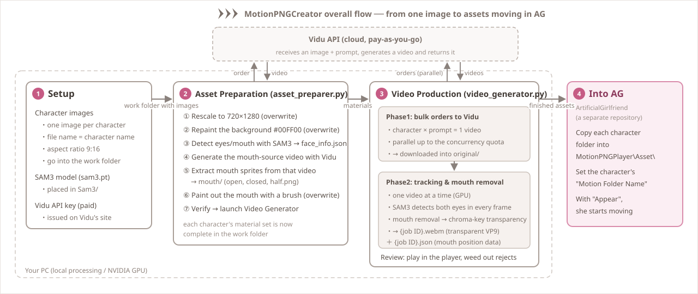

## How the Created Motion Assets Work

This section explains how the created motion assets move inside AG. AG's MotionPNGPlayer (the bundled review player works the same way) combines the three assets in the Motion folder to play the character.

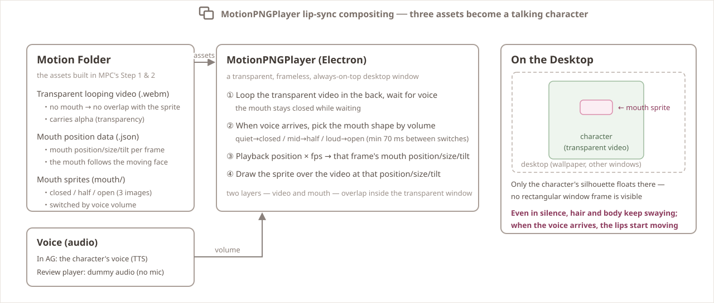

## System Requirements

- **OS: Windows 11** — developed and tested on Windows 11 (other OSes are untested)
- **GPU: NVIDIA GPU (CUDA) required** — SAM3, used for mouth removal and tracking, runs on the CUDA build of PyTorch (12.6). It may run on the CPU, but that is extremely slow, untested, and unsupported. AMD / Intel GPUs cannot be used. CUDA / cuDNN are installed automatically during environment setup (uv sync), so the only thing you need is the NVIDIA driver
- **Free disk space: 10 GB or more recommended** — actual usage is about 8 GB (Python environment ~4.5 GB + SAM3 model ~3.5 GB). On top of that, your work folder grows with every asset you generate

## Data and Privacy

- **No telemetry, no usage statistics, no automatic update checks**
- Character images and generated assets live in your work folder; settings (including the API key) live inside the repository folder. Everything stays on your PC — MPC never syncs anything anywhere
- The only data sent out is **the character images and prompts sent to the Vidu API** for video generation (handled under [Vidu](https://www.vidu.com/)'s terms). The only other traffic is the downloads from official sites during setup

## Setup

> [!TIP]
> Everything from here through asset creation is also covered in the [video guide](https://youtu.be/5BIfvkCkGUU).

Everything you do before launching MPC — from installation to preparing the work folder — happens in this chapter.

### Installation

1. Clone the repository from a terminal (Command Prompt or PowerShell). [Git](https://git-scm.com/) is required (install it first if you do not have it)
   ```powershell
   git clone https://github.com/ARP224/MotionPNGCreator-for-ArtificialGirlfriend.git
   ```
2. **Double-click `Installer MotionPNGCreator for AG.bat`.** The software in the table below is installed automatically (already-installed items are skipped, so it is safe to run any number of times)

| Installed | Purpose |
|---|---|
| [uv](https://docs.astral.sh/uv/) | Manages Python 3.12 itself and the dependencies |
| Git | Fetches a dependency (CLIP) |
| ffmpeg | Transparent WebM output, audio handling, previews |
| Node.js (LTS) | Launches the review player (Electron) |
| Python packages (`uv sync`) | PyTorch CUDA 12.6 build and more. **Downloads several GB** |
| Player dependencies (`npm install`) | Electron itself |

Using the installer is not mandatory. It is just a convenience — you can install everything manually via winget or from each official site instead.

<details>
<summary>Manual setup (what the installer does inside)</summary>

Assumes Git / ffmpeg / Node.js are installed and on PATH. ffmpeg must be a build that includes the libvpx-vp9 encoder (such as winget's Gyan.FFmpeg).

```powershell
# Install uv (if not installed; reopen the terminal afterwards)
powershell -ExecutionPolicy ByPass -c "irm https://astral.sh/uv/install.ps1 | iex"

# Sync dependencies in the repository folder
uv sync

# Player (Electron)
cd MotionPNGTuber_Player
npm install

# Sanity check
uv run python -c "import torch; print('CUDA:', torch.cuda.is_available())"
```
</details>

### Place the SAM3 model

SAM3 is an image-segmentation AI published by Meta, and it is **the core component of MPC**. Eye/mouth detection during preparation, and the tracking and mouth removal during production, all run on SAM3 — without the model, MPC does not work. The model file is distributed behind an approval gate, so this one step is manual.

1. Request access at [HuggingFace (facebook/sam3)](https://huggingface.co/facebook/sam3) and wait for approval (it will likely be granted within a few hours)
2. Once approved, download **`sam3.pt`** from the file list and put it in the repository's `Sam3/` folder (details in [Sam3/README.txt](Sam3/README.txt))

### Get a Vidu API key

[Vidu](https://www.vidu.com/) is a cloud AI that generates videos from images. The API key is your pass to its pay-as-you-go (credit-based) service. Create an account on the developer page ([platform.vidu.com](https://platform.vidu.com/)) and issue an API key. You will save the key into MPC later, on the first tab of "[Step 1](#step-1-asset-preparation-asset-preparer)". Cost estimates are covered in the Settings section of "[Step 2](#step-2-video-generation-video-generator)".

> [!CAUTION]
> The API key is stored **in plain text** in `.batch_settings.json` inside the repository folder (it never goes into Git). Be careful not to show the contents of that file to others, on streams or in screen shares.

### Prepare your character images

These are the requirements for the source images. This is what decides the quality of the result.

- **1 character = 1 image.** Facing forward with a closed mouth is recommended
- **The file name becomes the character name.** Non-ASCII names such as Japanese are fine. What you cannot use: the characters `\ / : * ? " < > |` plus `#` and `%`, a leading/trailing space or a trailing dot, Windows reserved names (CON and the like), and names longer than 60 characters (the checklist on tab ⓪ tells you why a name was rejected). Examples: `Aya.png`, `ゆず.png`
- **Aspect ratio 9:16** (portrait). Images that deviate will be distorted by the 720×1280 conversion
- **Make the background a single flat color (green screen recommended).** Automatic background-color detection looks at **the top-left and top-right corners** of the image, so compose the image with both top corners showing the background
- **Remove any watermarks from image-generation AI.** They interfere with background removal. Use images whose terms allow watermark removal (the "AI eraser" in Windows Photos editing removes them easily)

The author generates them with Google's Nano Banana. Hand it one of the sample images below and ask for "the same composition", and you get an image that meets the requirements with little effort. The samples cover two patterns: an upper-body VTuber style, and a three-heads-tall chibi character (full body).

<p>
  
  
</p>

> [!IMPORTANT]
> Some Step 1 stages (① rescale, ② background color replacement, ⑥ mouth removal) **overwrite the images in place**. If you need the originals, keep a copy elsewhere before putting them into the work folder.

### Create a work folder

Create a **work folder** (the folder used for this asset-generation run) anywhere on your PC and put the character images in it.

```
WorkFolder/          ← any name, any location (non-ASCII names are fine)
├── Aya.png          ← character image (1 per character)
└── Mia.png
```

That completes the pre-launch preparation. From the next chapter on, you launch MPC and create the assets.

## Step 1: Asset Preparation (Asset Preparer)

From here on you work inside MPC. **Double-click `Start_Asset_Preparer(step1).bat`** and the asset-preparation GUI (Asset Preparer) starts (no console window is shown; to see the logs, launch with `uv run python asset_preparer.py`).

Work through the tabs **from ⓪ to ⑦, left to right**. ①③④ run on all characters in one batch; ②⑤⑥ are per-character stages you repeat for every character.

### ⓪ Instructions

The tab where you set the work folder, save the API key, and run the pre-flight checks.

1. Press **Select Work Folder** and choose the work folder you created during setup
2. Enter your Vidu API key and press **Save**
3. **Confirm that every item in the Pre-flight Checklist shows ✓.** A remaining ✗ means that item's preparation is incomplete (△ is a warning — Git is not needed once the environment is built, and Node.js is only needed when you use the player)

- The UI language can be switched between English / 日本語 under **Language / 言語** (takes effect after restarting)

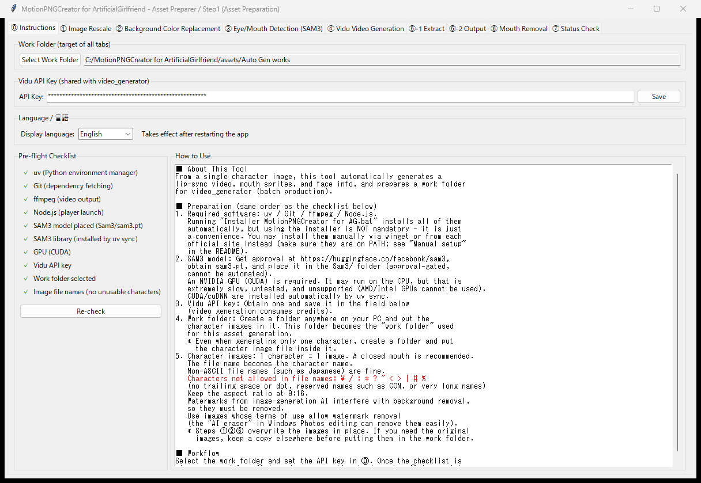

### ① Image Rescale

This stage rescales the images to 720×1280 to match the resolution of the videos you are about to generate.

- Press **Run Rescale** (all images directly under the work folder are processed at once)
- Images that deviate noticeably from 9:16 produce a warning. Proceeding distorts them, so replace or crop those images

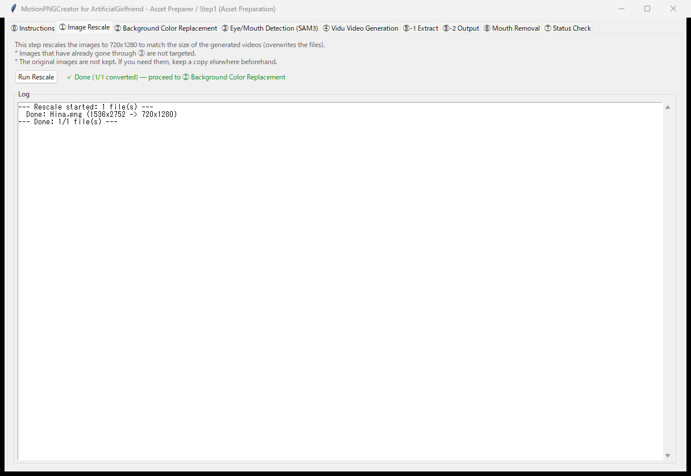

### ② Background Color Replacement

This stage converts the background to pure green (#00FF00) to squeeze out every bit of background-removal accuracy after video generation.

1. Select an image; the area detected as background is **shown in magenta (pink)**
2. Confirm the background is completely covered in magenta
3. Press **Replace and Overwrite**
4. Repeat for every character in the work folder

- **Left-click** the preview image to use the color at that spot as the reference color
- Adjusting **Tolerance** changes the color range treated as background

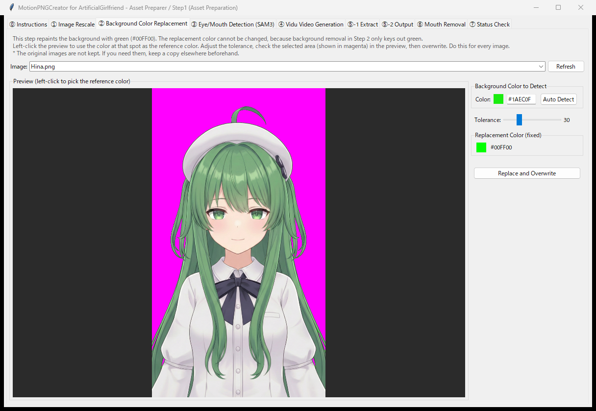

### ③ Eye/Mouth Detection (SAM3)

This stage extracts the character's eye and mouth positions with SAM3.

- Press **Run Detection** (all characters in one batch)
- The mouth position detected here is the reference for the mouth erasure and the mouth overlay during batch generation
- When it finishes, check in the preview that the eyes and mouth were captured correctly
- Detected images are automatically moved into a folder named after the character (the result is saved as `{character name}_face_info.json`)
- To redo the detection, delete `_face_info.json` inside the character folder and run it again

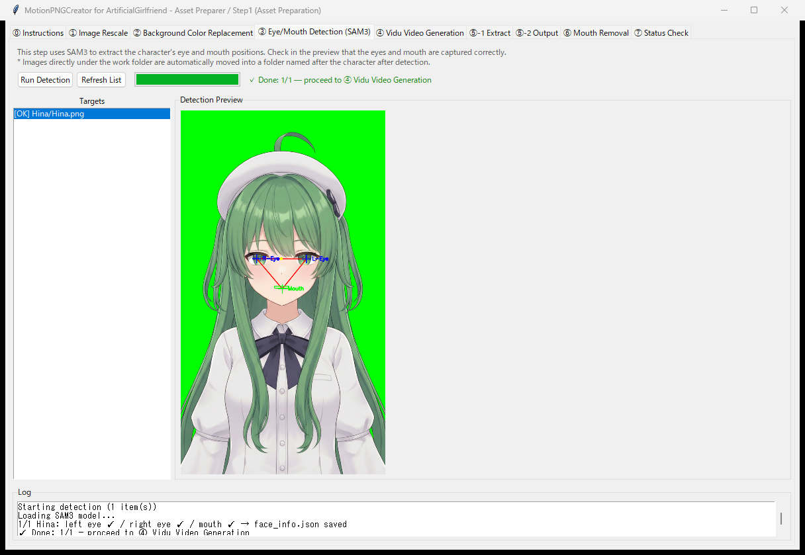

### ④ Vidu Video Generation

This stage generates one interim video per character, from which the mouth images are extracted in ⑤.

- Press **Start**. The estimated credits are shown, and generation begins after a confirmation dialog
- The video is saved to `{character name}/{character name}.mp4`
- The resolution is fixed at 720p (to match the Step 1 rescale and the batch videos)

> [!NOTE]
> Vidu credits are consumed from this stage on (14 credits per video with the default settings, viduq2-pro-fast at 4 seconds). Characters with an existing video are skipped by default, so re-running partway through does not double-charge you.

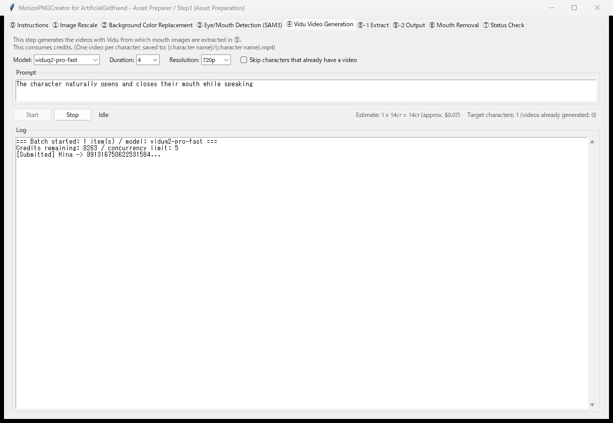

### ⑤-1 Extract

This stage extracts mouth sprites from the video generated in ④, using SAM3.

1. Select a character
2. Press **Start Analysis**
3. When the analysis finishes, candidates line up — pick the most suitable image for each of **Open** (open mouth) / **Closed** (closed mouth) / **Half** (half open)
4. Press **Go to ⑤-2**

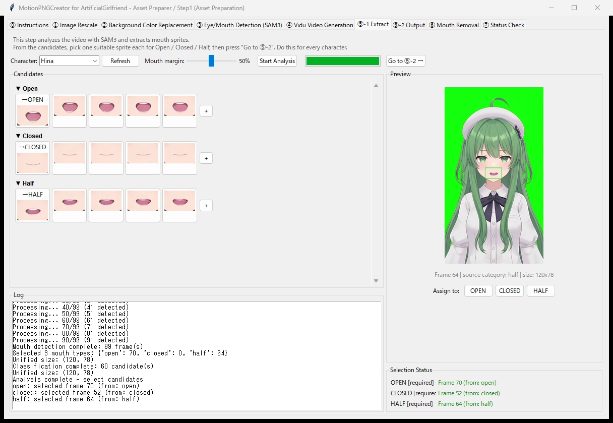

### ⑤-2 Output

This stage finishes the mouth images extracted in ⑤-1 and exports them.

1. Tweak the parameters (such as **Dilate**) until the selection hugs the edge of the mouth (the checkerboard in the preview is the transparent area)
2. Press **Export PNG** (open.png / closed.png / half.png are saved into `{character name}/mouth/`)
3. Go back to ⑤-1 and move on to the next character

- Position and size normally need no adjustment. If the mouth position is off-center, though, fix it — it affects where the mouth is composited

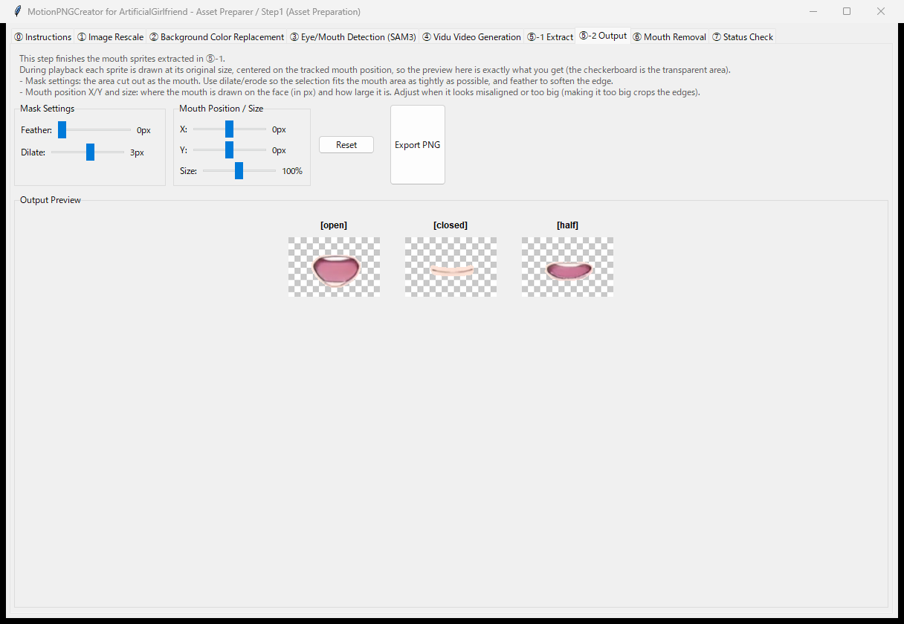

### ⑥ Mouth Removal

This stage removes the mouth from the character image so it will not interfere with mouth compositing — generating video from a mouthless image makes the later mouth removal more stable.

1. Select a character (the mouth area is automatically zoomed in)
2. In the right-hand preview, **right-click to sample** the color that will fill the mouth area
3. **Left-drag to paint over** the mouth
4. Press **Save (Overwrite)**
5. Repeat for every character in the work folder

- To redo the painting, **Discard Edits** returns to the last saved state
- If it does not come out well, remove the mouth with the "AI eraser" in Windows Photos editing and overwrite the file

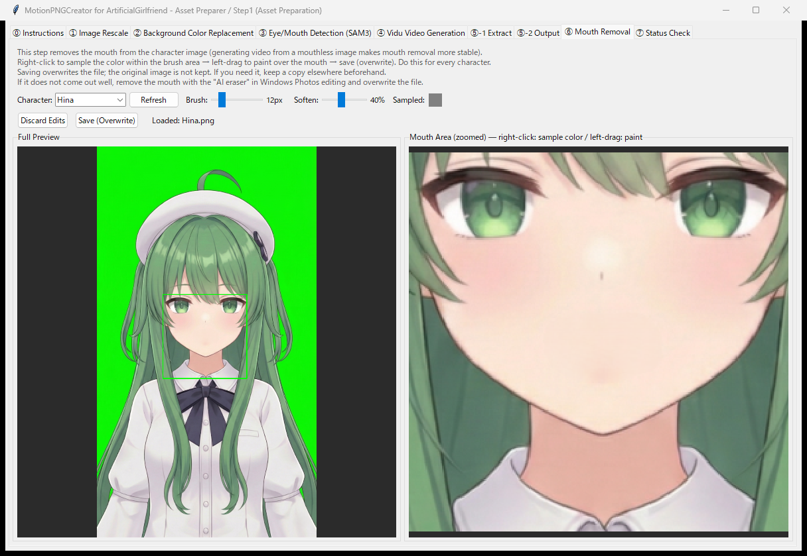

### ⑦ Status Check

This stage verifies that all previous stages completed correctly.

1. Confirm every character shows "OK" (if there is a problem, the reason appears in the **Issues** column)
2. Click **Ready → Launch video_generator** (Video Generator starts and Asset Preparer closes)

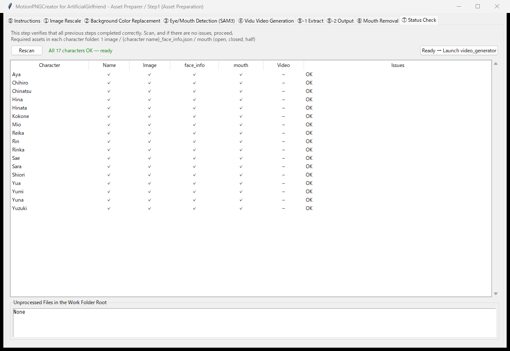

That completes Step 1, asset preparation.

## Step 2: Video Generation (Video Generator)

This is the mass-production stage. Move through the pages in the order **Settings → Prompt Lists → Main** to start generating, then check the results on **Review Outputs** and weed out the rejects.

### Settings before generating (the Settings page)

- **Video Generation** — which model generates how many seconds of video. Your choice. The resolution is fixed at 720p (to match the Step 1 rescale)
- **Background Transparency (Phase2)** — the color range treated as background (**Tolerance**). Use the tolerance you used in Step 1's ② Background Color Replacement as a reference
- **GPU Rest** — how many videos to process before pausing for how many seconds, to let the GPU cool down. The defaults are normally fine
- **Tracking** — smoothing of the mouth-position motion. Also fine as-is; adjust only if the generated videos have problems

Cost guide: the credits per video are decided by the model and duration. The default viduq2-pro-fast at 5 seconds is **16 credits per video**, and the on-screen estimate converts at $0.005 per credit (check the actual purchase price and pricing scheme at [Vidu](https://www.vidu.com/)).

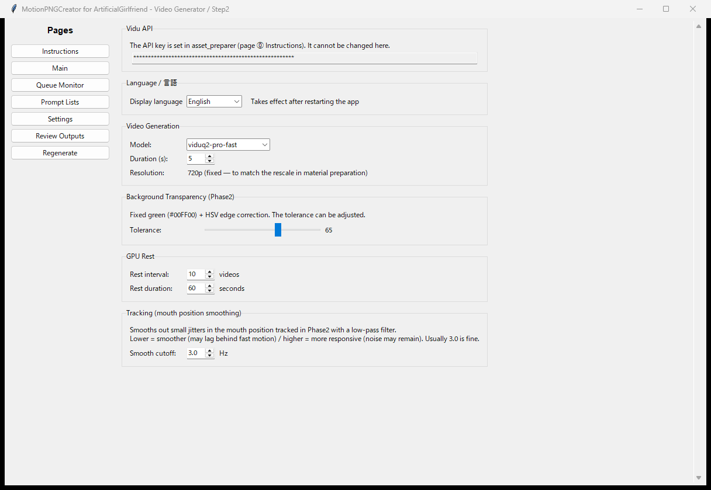

### Building prompt lists (the Prompt Lists page)

You describe the motions you want as lists of prompts.

- Type prompts in, or use **Load from File**, then press **Save**
- **1 prompt = 1 video.** Put 30 prompts in a list and you will generate 30 videos per character
- There are five prompt lists, A through E (max 50 prompts per list)

> [!IMPORTANT]
> Every prompt must include wording that means "**do not generate a mouth**" (e.g. `Do not generate a mouth.`) and "**keep the background green**" (e.g. `Keep the solid bright green background.`). Without the former, mouth-removal artifacts increase; without the latter, the background will not key out.

- Having a generative AI write your prompt list and loading it with **Load from File** is recommended. Two file formats are supported

  **A JSON string array** (.json):

  ```json
  [
    "waving hand. Do not generate a mouth. Keep the solid bright green background.",
    "nodding slowly. Do not generate a mouth. Keep the solid bright green background."
  ]
  ```

  **Plain text, one prompt per line** (.txt) — leading numbers and bullet marks (`1.` `-` `・` etc.) are removed automatically:

  ```text
  1. waving hand. Do not generate a mouth. Keep the solid bright green background.
  2. nodding slowly. Do not generate a mouth. Keep the solid bright green background.
  ```
- On first launch, List A / B come pre-filled with 30 prompts × 2 sets that the author actually used in production. You can use them as they are
- **Motions where the character turns away (motions that hide the eyes) are not supported.** The mouth position is derived from detecting the eyes in every frame

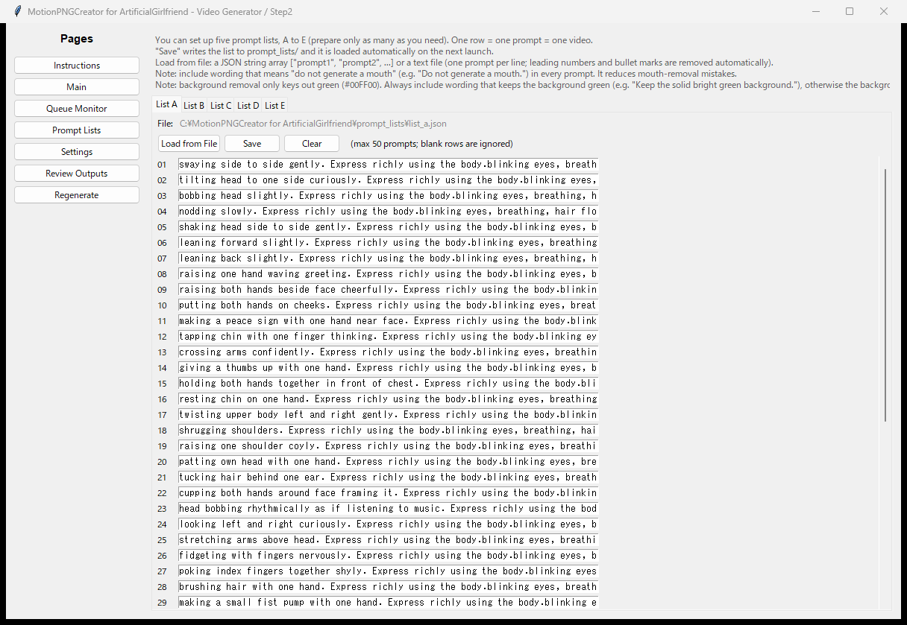

### Starting generation (the Main page)

1. In the character list, check which prompt lists each character should generate from
2. Click **Check Materials & Estimate** to confirm nothing is missing and that your Vidu credits will cover the run
3. **Start** begins generation (a confirmation dialog shows the video count and estimated credits)

- A character whose status is NG is missing materials (hover over it to show the reason at the bottom). Go back to Step 1 and fill in what is missing

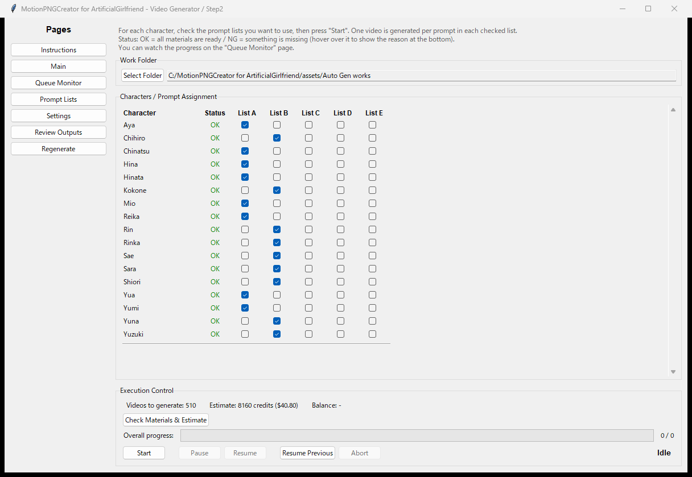

### While generating (the Queue Monitor page)

- This takes a long time. Every frame of every generated video is analyzed with SAM3 to track the mouth position, so each video costs GPU time. The author generated 500 videos in about 15 hours (on an RTX 4070 SUPER)
- Progress is shown on the **Queue Monitor**. **Phase1** (video generation on Vidu) runs in parallel up to your Vidu concurrency quota (typically 5), while **Phase2** (tracking & mouth removal) runs one video at a time on the GPU
- When the balance drops below one video's worth of credits, the batch auto-pauses. Add credits, then press **Resume**
- Interrupting is fine. Progress is saved to `batch_state.json` in the work folder, and **Resume Previous** picks up where you left off at any time

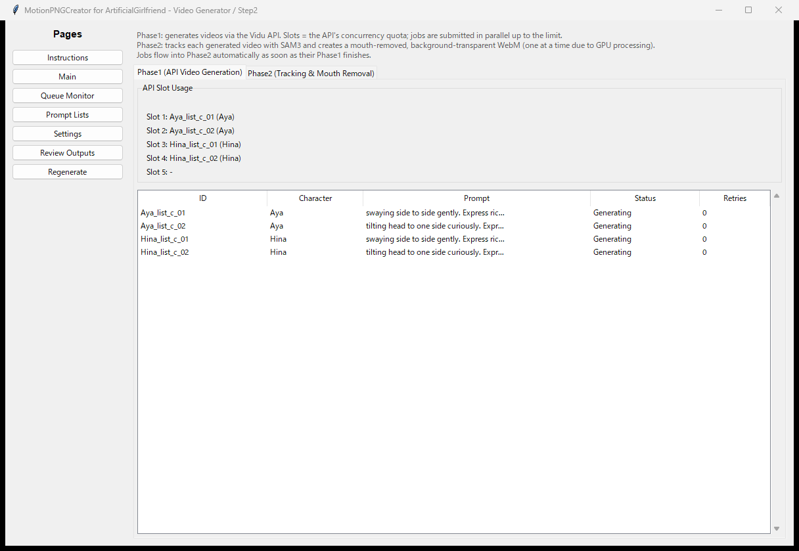

### After generation (the Review Outputs page)

1. Open the **Review Outputs** page and select a character
2. Check that background removal worked in the **Alpha Preview** (a magenta (pink) background means OK — magenta marks what became transparent)
3. Press **Start Playback** in the **Character Player** to check the actual motion and lip-sync (the bundled review player launches, reproducing lip-sync with dummy audio — no microphone involved). Rejects can be removed with the **Delete** button

> [!NOTE]
> Mouth removal does not succeed on every video. Rejects — where the composited mouth jitters a little or sits slightly crooked — appear at a rate of about 1 in 10. You can weed them out; how much you tolerate is up to you. The author keeps almost all of them.

> [!WARNING]
> **Delete** permanently removes the video, its tracking data, and the source video as a set (nothing goes to the recycle bin; it cannot be undone).

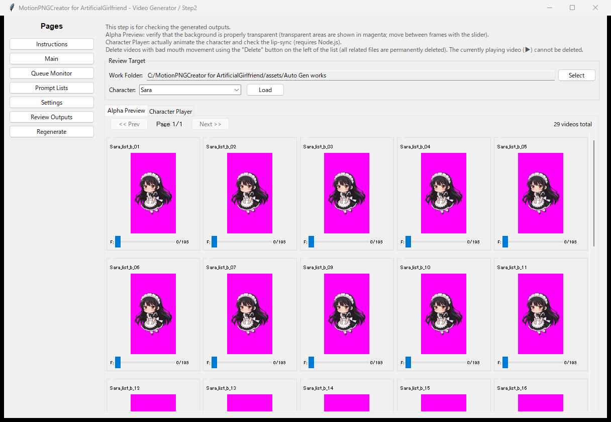

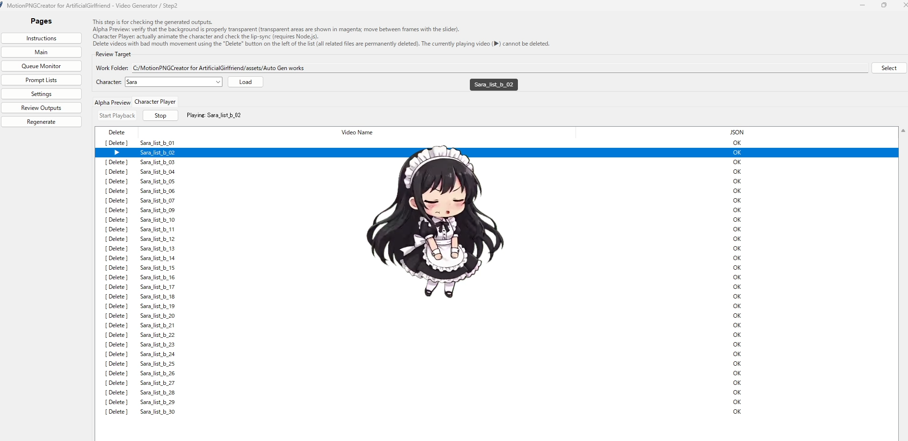

> [!NOTE]
> A moment where the mouth compositing has failed. If you find videos like this, weed them out as needed.

### Regeneration (the Regenerate page)

This page redoes only the tracking & mouth removal (Phase2) for failed or low-quality videos. Vidu is not involved, so **no credits are consumed**.

1. On the **Regenerate** page, choose the characters to regenerate (by default only failed videos are targeted)
2. **Start Regeneration** re-runs the tracking & mouth removal

- If it was just a GPU error, simply re-running produces a good video
- If the problem is the background range, change **Background Transparency** on the Settings page and regenerate
- Deleting the `original` folder inside a character folder (the Vidu source videos) makes regeneration impossible. Keep the `original` folders on the work-folder side

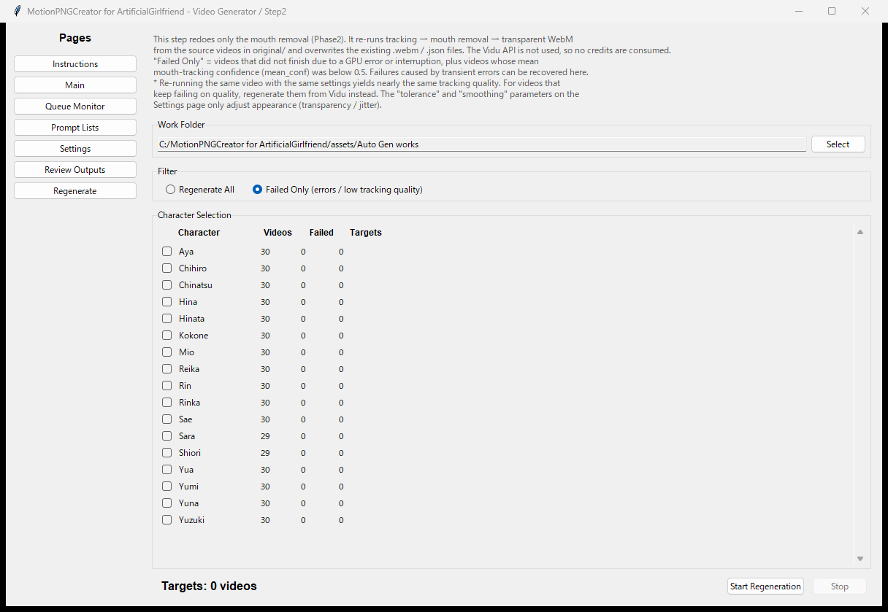

## Putting the Assets into AG (Finishing)

Finally, install the finished assets into AG itself.

1. Paste the character folders from your work folder into AG's `ArtificialGirlfriend\MotionPNGPlayer\Asset`
   ```
   ArtificialGirlfriend\
   └── MotionPNGPlayer\
       └── Asset\
           └── Aya\        ← copy the whole character folder from the work folder
               ├── Aya_list_a_01.webm   ← motion video (as many as you generated)
               ├── Aya_list_a_01.json   ← mouth position data with the same name
               ├── mouth\               ← mouth sprites
               └── original\ etc.       ← not used by AG (see below)
   ```
2. In AG, set the character's **Motion Folder Name**, and with the **Appear** button on the Utility Panel, she shows up on the desktop in that form

- The copied `original` folder is a backup of the Vidu source videos. AG does not need it, so you can delete it — or leave it; it only takes up some space and does no harm (the same goes for `_metrics.json` and the other extra files)
- **Keeping the work-folder side intact is recommended.** It remains your base for regeneration and further production
- When you move a character folder with a non-ASCII name to another PC, carry it as a plain folder (shared folder, OneDrive, USB drive) rather than a zip. A zip whose creator and extractor disagree on text encoding garbles the folder name (observed with a zip made by macOS "Compress" and extracted on Windows)

That's a wrap.

## Troubleshooting

When something does not work — or you are not sure whether it is a bug — check here first.

### Setup issues

- **The installer fails or stalls** — for network errors, simply re-run it (installed items are skipped and it continues from where it stopped). If it says winget is missing, update "App Installer" from the Microsoft Store. If freshly installed software is not recognized, reboot the PC and re-run
- **uv sync fails** — run `uv cache clean`, then `uv sync` again
- **CUDA is not recognized** — if `uv run python -c "import torch; print(torch.cuda.is_available())"` prints `False`, update your NVIDIA driver
- **The SAM3 model fails to load** — confirm the file exists at `Sam3/sam3.pt` and that your HuggingFace access has been approved
- **ffmpeg not found / cannot output WebM** — mouthless WebM output requires an ffmpeg build with the libvpx-vp9 encoder. Use the ffmpeg installed by the installer

### Generation issues

- **It will not start / I want to see the logs** — the `Start_*.bat` launchers hide the console. To see error details, open a terminal in the repository folder and launch with `uv run python asset_preparer.py` (or `uv run python video_generator.py`)
- **The background will not key out** — check, in order: ① the prompt includes the "keep the background green" wording, ② raise **Tolerance** on the Settings page and regenerate, ③ no watermark remains on the source image
- **Mouth remnants / misplaced mouth** — confirm the prompt includes the "do not generate a mouth" wording. GPU-error cases can be redone on the **Regenerate** page. If regenerating the same video does not improve it, delete that video or regenerate it from Vidu
- **The player will not launch** — confirm Node.js is installed and `npm install` has been run in `MotionPNGTuber_Player/` (the installer does this)
- **Video processing fails** — if the work-folder or repository path contains characters that your Windows system code page cannot represent (emoji, for example, or Japanese on an English-language Windows), video processing (OpenCV) can fail. Characters covered by your system's language are fine (Japanese paths were verified on Japanese Windows). If a warning appears when you select the work folder, move it to an ASCII-only path (e.g. `C:\Work`)

For unresolved bugs, report them on [Issues](https://github.com/ARP224/MotionPNGCreator-for-ArtificialGirlfriend/issues). Including what you did, what happened, and the console output from a `uv run python ...` launch speeds up the investigation a lot. Questions and chat are welcome on [Discussions](https://github.com/ARP224/MotionPNGCreator-for-ArtificialGirlfriend/discussions).

## Update & Uninstall

### Update

1. Close the GUIs
2. Run `git pull` in the repository folder
3. Re-run `Installer MotionPNGCreator for AG.bat` (only the differences are processed)

Settings, prompt lists and the assets in your work folder are kept.

Updates are announced on [GitHub Releases](https://github.com/ARP224/MotionPNGCreator-for-ArtificialGirlfriend/releases). Set the repository to **Watch > Custom > Releases** to get notified.

### Uninstall

This tool places nothing outside the repository folder.

1. **The app itself** — just delete the repository folder (the Python environment `.venv`, the settings files and the player's `node_modules` are all inside it). Your work folder lives wherever you created it; delete it if you wish
2. **Shared tools the installer added** (uv / Git / ffmpeg / Node.js) — these are general-purpose tools other apps may use, so they are not removed automatically. Remove them manually only if you no longer need them:
   ```powershell
   winget uninstall Git.Git
   winget uninstall Gyan.FFmpeg
   winget uninstall OpenJS.NodeJS.LTS
   # uv itself, uv-managed Python, caches
   Remove-Item -Force "$env:USERPROFILE\.local\bin\uv.exe", "$env:USERPROFILE\.local\bin\uvx.exe"
   Remove-Item -Recurse -Force "$env:APPDATA\uv", "$env:LOCALAPPDATA\uv"
   ```
3. **Other traces (optional)** — `%APPDATA%\Ultralytics` (a settings folder created by the SAM3 runtime library)

## About the Project

### Tech stack

| Area | Technology |
|---|---|
| Language & foundation | Python 3.12 / PyTorch (CUDA 12.6) / [uv](https://docs.astral.sh/uv/) |
| GUI | tkinter |
| Eye/mouth detection | [SAM3 (Meta)](https://huggingface.co/facebook/sam3) / [Ultralytics](https://github.com/ultralytics/ultralytics) |
| Video generation | [Vidu API](https://www.vidu.com/) |
| Video processing | OpenCV / ffmpeg (libvpx-vp9, VP9 WebM with alpha) |
| Review player | Electron 28 / websockets (GUI integration) |

### Background and challenges

Originally, I had no plans to give [Artificial Girlfriend](https://github.com/ARP224/ArtificialGirlfriend) (AG) a character visual made of motion assets like these. I had convinced myself it would be too hard for someone like me, who had never even touched VRM. But at the very end of 2025, rotejin released [MotionPNGTuber](https://github.com/rotejin/MotionPNGTuber), and soon after, kazuya-bros released [MouthSpriteExtractor-SAM3](https://github.com/kazuya-bros/MouthSpriteExtractor-SAM3). Suddenly it felt like this might actually be doable — and that feeling is what brought me all the way here.

What I wanted from MPC was simple: to auto-generate a large volume of character motion assets, easily. With one image and a Vidu API key you can mass-produce them — it takes processing time, but it works — so I think that goal has been met.

That said, I feel the quality is still far from enough. A certain share of the output comes out defective, with the mouth jittering or the mouth position drifting. There are constraints, such as the character not being able to turn around. On characters with blush on their cheeks, the mouth sometimes gets filled in with that color. And emotional expression through facial expressions is not supported.

Also, lately I have been seeing posts on X about VRM models made with AI. If AG's character visuals are developed further, that may be the direction to go. (Though I also feel the convenience of mass-producing from a single image is hard to give up.)

My own implementation skills and imagination only go so far. If you are reading this and find the project interesting, pull requests are welcome, and if you have ideas, I would be glad to [discuss](https://github.com/ARP224/MotionPNGCreator-for-ArtificialGirlfriend/discussions) them with you.

Finally, as I also wrote in [AG's README](https://github.com/ARP224/ArtificialGirlfriend#background-and-challenges), this project is not meant to replace romance with a human. Everyone, I think, goes through times and situations when building relationships with people is hard. My hope is that, at such times, having an AI girlfriend by your side making life a little livelier can bring a sense of security — and that this security becomes a small push toward feeling positive about relationships with people.

### Contributing

Anyone willing to help push the possibilities of an AI girlfriend further is welcome.

- Pull requests are welcome. Small fixes are easy to take in; for large changes, please discuss them first in [Issues](https://github.com/ARP224/MotionPNGCreator-for-ArtificialGirlfriend/issues). Changes that touch behavior go through the maintainer's hands-on verification, so merging can take a while (and replies may be slow — this is a solo project)
- Issues and PRs are welcome in either English or Japanese
- If you change the UI text (`locales/`), check the EN/JA consistency with `uv run python tools/check_locales.py`
- The development guide (pre-PR checks, code conventions, how to write bug reports) is in [CONTRIBUTING.md](CONTRIBUTING.md)

### About the developer

I am an amateur solo developer in Japan. I post on X and YouTube: [X (@RyoAIGF)](https://x.com/RyoAIGF) / [YouTube (@RyoAIGF)](https://www.youtube.com/@RyoAIGF).

### License

MotionPNGCreator for ArtificialGirlfriend is provided under **AGPL-3.0-only** (GNU Affero General Public License version 3; see `LICENSE`). The Ultralytics library used to run SAM3 is AGPL-3.0, so the whole repository (including `MotionPNGTuber_Player/`) carries this license.

Using it normally, or modifying it for yourself, imposes no special obligations. And **the assets this tool generates (WebM / PNG / JSON) are outside the scope of this license** — a program's output is not a derivative work, so how you use the generated assets is not restricted.

- This project derives from the following three upstreams. Per-file origins and the original copyright notices are in [NOTICE.md](NOTICE.md)
  - [MotionPNGTuber](https://github.com/rotejin/MotionPNGTuber) (MIT License, Copyright (c) 2025 rotejin)
  - [MotionPNGTuber_Player](https://github.com/rotejin/MotionPNGTuber_Player) (MIT License, Copyright (c) 2026 rotejin)
  - [MouthSpriteExtractor-SAM3](https://github.com/kazuya-bros/MouthSpriteExtractor-SAM3) (AGPL-3.0, Copyright (c) 2026 kazuya-bros)
- **SAM3 model usage restrictions** — the SAM3 weights are distributed under Meta's SAM License, which prohibits military, weapons, espionage and similar uses. This prohibition applies to the process of generating your assets (details in [NOTICE.md](NOTICE.md))
- Use of the Vidu API is subject to [Vidu](https://www.vidu.com/)'s terms of service

The name "MotionPNGCreator for ArtificialGirlfriend" identifies this project. If you publish a fork, please replace it with a name of your own.

Copyright (C) 2026 Ryo (ARP224)

#### Disclaimer

- **Your Vidu API charges are your own responsibility.** The tool's estimates and balance checks are aids; they cannot track pricing changes
- Backing up your assets and work-folder data against loss is your responsibility
- Use the generated assets within the terms of Vidu, SAM3 and the other services and models involved

### Acknowledgments

MPC stands on the work of these people.

- **rotejin** ([MotionPNGTuber](https://github.com/rotejin/MotionPNGTuber)) — the author of the original project. [Explanatory article (note, Japanese)](https://note.com/rotejin/n/n2b12c9be0b81)
- **kazuya-bros** ([MouthSpriteExtractor-SAM3](https://github.com/kazuya-bros/MouthSpriteExtractor-SAM3)) — the author of MPC's direct fork source, which integrated SAM3 into the original
- **Meta** ([SAM3](https://huggingface.co/facebook/sam3)) — the eye/mouth detection and segmentation model
- **Ultralytics** ([Ultralytics](https://github.com/ultralytics/ultralytics)) — the runtime library for SAM3
- **Vidu** ([vidu.com](https://www.vidu.com/)) — the image-to-video generation API
- **Claude Code**, which wrote all the code of this program
- And everything else, listed here or not, that went into making MotionPNGCreator — thank you
